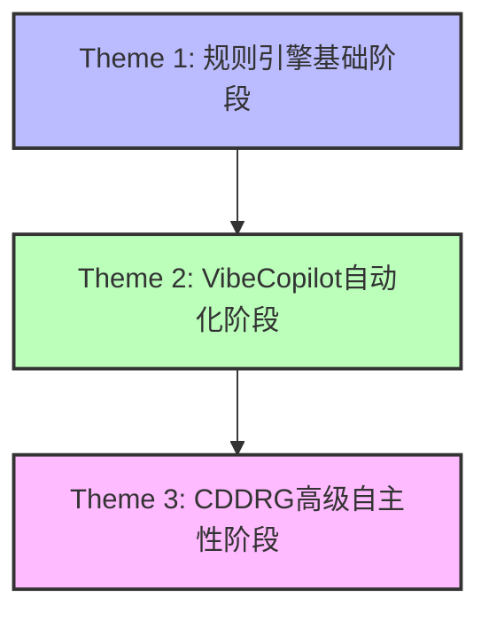

# VibeCopilot 开发阶段与主要任务

> **文档元数据**
> 版本: 1.0
> 更新日期: 2024-06-02
> 状态: 初稿
> 负责团队: 系统架构团队

## 概述

VibeCopilot 项目的开发遵循渐进式演进策略，分为三个主要阶段（Theme），每个阶段都有其明确的目标、关注点和核心任务。本文档总结了各阶段的主要内容，为开发团队提供清晰的路线图指引。

## 开发阶段总览

## Theme 1: 规则引擎基础阶段

这一阶段聚焦于建立稳固的规则引擎基础设施，实现AI行为的可控和标准化。

### 主要目标

- 建立标准化的规则体系
- 实现规则解析和应用的基础机制
- 构建规则存储和管理的基础架构

### 核心任务

1. **规则引擎核心组件开发**
   - 规则管理器：协调各组件工作，管理规则生命周期
   - 规则存储：持久化存储规则定义和元数据
   - 规则解析器：解析和验证规则内容
   - 规则应用器：在适当的上下文中应用规则

2. **规则类型与格式定义**
   - 定义四种核心规则类型：代理选择型、全局规则、自动选择型、手动规则
   - 建立标准化的`.mdc`文件格式（Markdown with YAML frontmatter）

3. **模板系统构建**
   - 开发规则模板生成器
   - 实现模板变量机制
   - 建立模板验证逻辑

4. **规则应用机制实现**
   - 实现基于文件类型的规则自动选择
   - 开发手动规则调用机制
   - 构建规则冲突解决策略

### 关键交付物

- 规则引擎核心库
- 规则文件格式规范
- 基础规则模板集
- 规则应用API

## Theme 2: VibeCopilot自动化阶段

这一阶段基于规则引擎基础，发展为完整的开发辅助系统，实现开发流程的标准化和可控性。

### 主要目标

- 建立多层次规则体系覆盖开发全生命周期
- 开发标准化命令集实现开发任务的一致处理
- 设置强制性检查点确保流程规范执行
- 构建知识图谱生态实现开发知识的沉淀

### 核心任务

1. **规则体系扩展**
   - 核心规则(core-rules)：定义基础行为和标准
   - 开发规则(dev-rules)：规范开发流程和代码质量
   - 流程规则(flow-rules)：定义开发生命周期和强制检查点
   - 命令规则(cmd-rules)：实现标准化命令接口
   - 角色规则(role-rules)：定义专家角色和职责
   - 工具规则(tool-rules)：规范工具使用方法

2. **命令集开发**
   - `/plan`：创建和管理开发计划
   - `/task`：管理项目任务，跟踪进度和状态
   - `/branch`：创建和管理与任务关联的分支
   - `/check`：执行项目进度和健康度检查
   - `/memory`：保存和检索重要对话和知识
   - `/story`：管理用户故事和需求文档
   - `/update`：更新开发状态和进度
   - `/help`：提供命令帮助和使用指南

3. **流程检查点机制**
   - PRE-FLOW阶段：需求文档和PRD完整性检查
   - PLANNING阶段：开发计划和任务分解检查
   - DEVELOPMENT阶段：代码规范和质量检查
   - TESTING阶段：测试覆盖率和完整性检查
   - REVIEW阶段：代码审核和文档同步检查
   - RELEASE阶段：版本发布准备检查
   - POST-FLOW阶段：经验总结和规则更新检查

4. **知识图谱系统构建**
   - 即时记忆层：使用MCP工具的Basic Memory功能保存重要对话
   - 知识提取层：通过LangChain脚本将文档内容结构化导入
   - 知识组织层：使用Obsidian建立可视化知识图谱
   - 知识展示层：通过Docusaurus构建公开的文档系统

### 关键交付物

- 完整的规则体系库
- 标准化命令集实现
- 开发流程检查点系统
- 知识管理基础设施
- GitHub深度集成组件

## Theme 3: CDDRG高级自主性阶段

这一阶段引入"命令驱动的动态规则生成"（CDDRG）范式，重点提升AI智能体的自主性与适应性，同时保持行为的可控性。

### 主要目标

- 实现"文档->规则->代码"的核心工作流
- 开发动态规则生成机制，提升上下文适应性
- 建立知识循环机制，实现持续学习与优化
- 构建明确的人机协作模式，确保过程可控

### 核心任务

1. **CDDRG引擎开发**
   - 源命令(Source Commands)解析器：处理高层级、意图驱动的命令
   - 智能体(Agent)实现：接收命令，调用RGI，执行计划，生成报告
   - 规则生成接口(RGI)开发：基于LLM，结合RAG、知识图谱等技术

2. **知识源管理系统**
   - 动态演化：包含显式规则、策略文档、最佳实践、API文档、代码示例等
   - 知识循环：收集、处理开发过程中产生的有价值信息
   - 知识存储：归档执行日志、成果链接、问题解决方案等

3. **人机协作模式实现**
   - 指令下达(Human)：结构化源命令及参数
   - 查询与规划(Agent + RGI)：生成行动指南/执行计划
   - 计划确认(Human)：审核和显式确认
   - 执行与报告(Agent)：执行任务，记录日志
   - 知识存储(System/Agent)：归档关键信息

4. **高级功能开发**
   - 可解释性：详细记录RGI推理链
   - 冲突检测：自我检查，快速冲突扫描
   - 知识源管理：版本控制，元数据标记

### 关键交付物

- CDDRG引擎核心实现
- 动态规则生成接口
- 知识循环管理系统
- 人机协作工作流引擎
- 高级应用场景示例

## 开发阶段关系与演进

三个开发阶段具有明确的渐进关系，每个阶段都建立在前一阶段的基础上，并增加新的能力和维度：

- **Theme 1** 建立了基础规则系统，实现了最基本的规则定义和应用。
- **Theme 2** 在此基础上扩展了完整的规则体系、命令集和强制检查点，实现了开发流程的标准化。
- **Theme 3** 则进一步引入动态规则生成能力，建立知识循环，提升了系统的自主性和适应性。

这种渐进式的开发策略确保了项目可以分阶段交付有价值的功能，同时保持长期的技术愿景和发展方向。

## 当前状态与下一步

截至2024年6月，项目处于**Theme 2阶段的后期**，已经完成了规则体系和命令集的开发，正在完善知识图谱系统和GitHub集成。

下一步计划：

1. 完成Theme 2的剩余任务，特别是知识管理部分
2. 开始Theme 3的准备工作，包括CDDRG概念验证和源命令解析器的初步设计
3. 对现有规则体系进行全面评估，为动态规则生成做准备

## 参考文档

- [规则引擎概述](../arch_v1/01-rule-engine-overview.md)
- [VibeCopilot产品规范与实现白皮书](../arch_v2/2_prd.md)
- [命令驱动的动态规则生成白皮书](../arch_v3/白皮书：命令驱动的动态规则生成——赋能下一代智能体自主性与适应性-1ca73a85.md)
