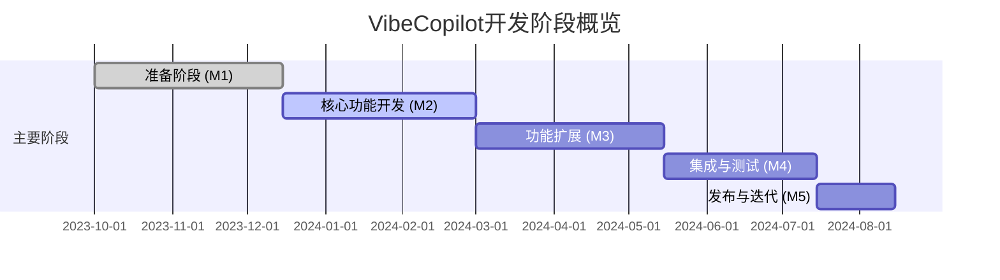

# VibeCopilot 开发路线图指南

本文档提供VibeCopilot项目路线图的访问和管理方法，不再硬编码项目进度，而是说明如何通过GitHub Projects实时查看和更新开发状态。

## 1. 路线图管理方式

VibeCopilot项目使用GitHub Projects作为路线图管理工具，而非静态文档：

- **实时数据**: 所有进度和任务状态实时更新
- **自动化**: 与代码提交和PR关联，自动反映实际进度
- **多维视图**: 支持看板、表格、甘特图等多种查看方式
- **团队协作**: 支持多人实时编辑和更新

## 2. 访问项目路线图

### 2.1 在线访问

1. 访问GitHub项目页面: [https://github.com/jacobcy/VibeCopilot](https://github.com/jacobcy/VibeCopilot.md)
2. 点击顶部导航栏中的"Projects"选项卡
3. 选择"VibeCopilot Roadmap"项目
4. 选择合适的视图:
   - **看板视图**: 按开发阶段分组的任务
   - **表格视图**: 详细的任务列表和属性
   - **甘特图视图**: 时间线和依赖关系

### 2.2 通过API访问

可以通过GitHub GraphQL API查询项目数据:

```graphql
query {
  repository(owner: "jacobcy", name: "VibeCopilot") {
    projectV2(number: 1) {
      title
      items(first: 100) {
        nodes {
          id
          fieldValues(first: 8) {
            nodes {
              ... on ProjectV2ItemFieldTextValue {
                text
                field { ... on ProjectV2FieldCommon { name } }
              }
              ... on ProjectV2ItemFieldDateValue {
                date
                field { ... on ProjectV2FieldCommon { name } }
              }
              ... on ProjectV2ItemFieldSingleSelectValue {
                name
                field { ... on ProjectV2FieldCommon { name } }
              }
            }
          }
          content {
            ... on Issue {
              title
              state
              labels(first: 10) { nodes { name } }
              assignees(first: 5) { nodes { login } }
            }
          }
        }
      }
    }
  }
}
```

### 2.3 命令行访问

使用GitHub CLI工具查看路线图:

```bash
# 安装GitHub CLI
brew install gh  # macOS
# 登录
gh auth login
# 如果遇到权限问题，刷新令牌添加项目访问权限
gh auth refresh -s read:project
# 查看项目列表获取项目编号
gh project list --owner jacobcy
# 使用项目编号查看项目（替换 <number> 为实际项目编号）
gh project view <number>
# 或者使用网页模式打开
gh project view --web "VibeCopilot Roadmap"
```

### 2.4 导入路线图数据

项目路线图数据可以通过导入脚本从本地YAML文件导入到GitHub Projects:

```bash
# 确保你的GitHub令牌具有以下权限:
# - repo (仓库完整访问权限)
# - read:org (组织读取权限)
# - project (项目权限)

# 方法1: 使用环境变量设置令牌
export GITHUB_TOKEN=your_token_here
python scripts/import_roadmap_to_github.py --create-project

# 方法2: 直接在命令行指定令牌
python scripts/import_roadmap_to_github.py --create-project --token your_token_here

# 如果你使用gh cli已登录，可以这样使用:
python scripts/import_roadmap_to_github.py --create-project --token $(gh auth token)
```

**注意**: 导入脚本需要`read:org`权限来获取GitHub用户ID，请确保你的令牌包含此权限。

#### 将现有Issues添加到项目

如果你已经创建了项目和Issues，但需要将Issues添加到项目中，可以使用以下脚本：

```bash
# 确保设置了GITHUB_TOKEN环境变量或使用gh cli已登录
python scripts/add_issues_to_project.py --owner jacobcy --repo VibeCopilot --project-number 3
```

其中`--project-number`是GitHub Projects的编号，可以通过`gh project list --owner jacobcy`命令获取。

## 3. 项目开发阶段概览

VibeCopilot项目开发分为以下几个主要阶段，详细任务已在GitHub Projects中配置:

- **准备阶段 (M1)**: 项目规划、架构设计和环境搭建 ✅
- **核心功能开发 (M2)**: 核心引擎、状态管理、文档系统和AI集成
- **功能扩展 (M3)**: 项目分析、工具推荐、前端界面和CLI接口
- **集成与测试 (M4)**: 组件集成、系统测试和用户验收测试
- **发布与迭代 (M5)**: Alpha/Beta/正式版发布和持续优化



## 4. 里程碑与优先级

### 4.1 里程碑设置

在GitHub Projects中，我们使用以下里程碑:

| 里程碑 | 描述 | 预计日期 | 状态 |
|--------|------|----------|------|
| M1 | 准备阶段完成 | 2023-12-15 | 已完成 |
| M2 | 核心功能开发完成 | 2024-03-01 | 进行中 |
| M3 | 功能扩展完成 | 2024-05-15 | 计划中 |
| M4 | 集成与测试完成 | 2024-07-15 | 计划中 |
| M5 | 正式版发布 | 2024-08-15 | 计划中 |

### 4.2 优先级设置

在GitHub Projects中使用以下优先级标签:

- **P0 (最高优先级)**: 核心功能，必须实现
- **P1 (高优先级)**: 重要功能，应该实现
- **P2 (中优先级)**: 有价值但非关键功能
- **P3 (低优先级)**: 可选功能，如有时间实现

## 5. AI与路线图集成

VibeCopilot开发过程中，AI可以通过以下方式与路线图集成:

### 5.1 通过API读取路线图

AI可以使用GitHub API获取路线图数据:

```python
import requests

def get_roadmap_data():
    headers = {
        "Authorization": "Bearer GITHUB_TOKEN",
        "Accept": "application/vnd.github.v3+json"
    }
    url = "https://api.github.com/repos/jacobcy/VibeCopilot/projects"
    response = requests.get(url, headers=headers)
    return response.json()
```

### 5.2 AI辅助任务管理

- AI可分析当前代码库状态与路线图的匹配度
- 生成新任务和子任务的详细描述
- 推荐下一步优先开发的功能
- 创建PR时自动关联相关Issue

## 6. 路线图更新流程

路线图更新应通过GitHub Projects进行，而非直接修改本文档:

1. 在项目会议中讨论路线图变更
2. 在GitHub Projects中更新相应任务和里程碑
3. 通过自动化脚本或GitHub Actions生成进度报告
4. 必要时更新本文档中的阶段概览图表(不更新具体任务)

## 7. 未来规划

VibeCopilot 1.0发布后的发展方向已在GitHub Projects中记录为未来里程碑(M6+)，主要包括:

- 生态系统扩展
- 企业版开发
- 更多AI集成
- 社区建设
- 高级分析功能
- 跨平台支持

---

**注**: 本文档仅提供路线图的访问方法和概览，详细最新进度请查看GitHub Projects。如需详细使用指南，请参考[GitHub Projects使用指南](github_projects_guide.md)。
