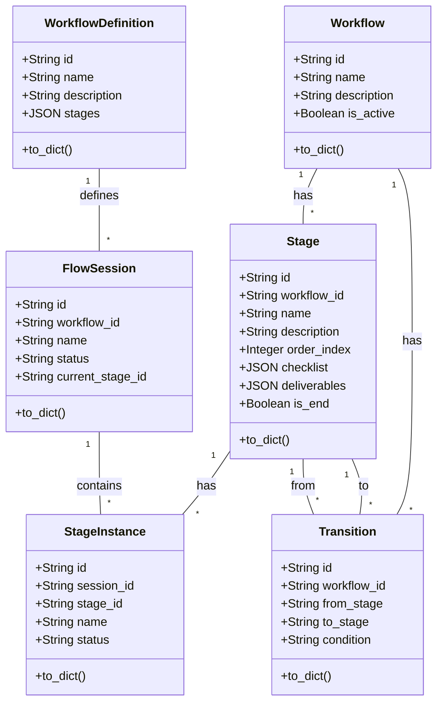

# 工作流数据结构重构文档

## 重构概述

根据`docs/dev/issues/flow-session-refaction.md`中的计划，我们对工作流相关的数据结构进行了重构，主要包括以下几点：

1. **新增模型类**：
   - 添加了`Stage`类，存储工作流阶段信息
   - 添加了`Transition`类，存储阶段间转换关系

2. **拆分文件**：
   - 将`WorkflowDefinition`类从`flow_session.py`移动到独立的`workflow_definition.py`文件

3. **更新关系**：
   - 在`Workflow`类中添加了与`Stage`和`Transition`的关系
   - 更新了`StageInstance`类，添加了与`Stage`的关系

4. **添加仓库类**：
   - 添加了`StageRepository`和`TransitionRepository`仓库类
   - 更新了相关导入和引用

5. **创建数据迁移脚本**：
   - 添加了数据迁移脚本，将旧结构数据迁移到新结构

## 变更详情

### 新增文件

1. `src/models/db/stage.py`：新增`Stage`类，定义工作流阶段模型
2. `src/models/db/transition.py`：新增`Transition`类，定义阶段转换模型
3. `src/models/db/workflow_definition.py`：从`flow_session.py`移出的`WorkflowDefinition`类
4. `src/db/repositories/stage_repository.py`：新增阶段仓库类
5. `src/db/repositories/transition_repository.py`：新增转换仓库类
6. `src/scripts/migrate_workflow_structure.py`：数据迁移脚本

### 更新文件

1. `src/models/db/workflow.py`：更新`Workflow`类，添加与`Stage`和`Transition`的关系
2. `src/models/db/flow_session.py`：
   - 移除`WorkflowDefinition`类
   - 更新`StageInstance`类，添加与`Stage`的关系
3. `src/models/db/__init__.py`：更新导入和导出
4. `src/db/repositories/__init__.py`：添加新仓库类的导入和导出
5. `src/cli/commands/flow/handlers/next_handler.py`：更新导入路径和引用

## 数据迁移

1. **迁移步骤**：
   - 将`WorkflowDefinition.stages`迁移到`Stage`表
   - 基于阶段顺序创建`Transition`记录
   - 将`WorkflowStep`迁移到`Stage`表

2. **运行迁移脚本**：
   ```bash
   cd /Users/jacobcy/Public/VibeCopilot
   python src/scripts/migrate_workflow_structure.py
   ```

## 代码清理

为了避免未来开发工作中的混淆，我们进行了以下代码清理工作：

1. **删除旧模型文件**：
   - 删除了 `src/workflow/models/workflow_definition.py` 文件

2. **保留并更新其他文件**：
   - 更新了 `src/workflow/models/__init__.py`，只导出与界面交互相关的模型
   - 将 `src/models/workflow.py` 转换为重定向模块，保证兼容性并发出弃用警告
   - 修改了 `src/workflow/workflow_operations.py` 中的导入引用

3. **添加说明文档**：
   - 在 `src/workflow/models/README.md` 中添加了清晰的说明文档
   - 包含了旧模型与新模型的对应关系
   - 指导开发者如何使用新的数据结构

## 后续工作

1. **数据库升级**：
   - 执行数据库迁移，创建新表
   - 运行迁移脚本，迁移数据

2. **测试**：
   - 测试各个功能点，确保重构后系统能正常工作
   - 测试工作流创建、执行、查询等功能

3. **更新文档**：
   - 更新相关开发文档，反映新的数据结构
   - 为新仓库类添加API文档

4. **完全移除弃用代码**：
   - 在确保所有功能正常后，可以完全移除弃用的重定向模块
   - 清理代码中的引用，直接使用新的数据库模型

## 架构图


