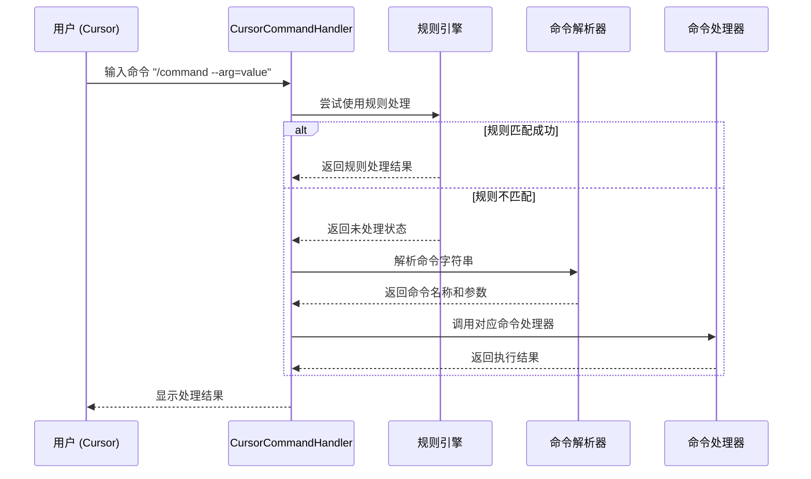

# VibeCopilot 命令系统开发指南

## 1. 命令系统概述

VibeCopilot命令系统是一个基于Cursor命令处理的接口层，负责接收用户在Cursor IDE中输入的命令，解析并路由到相应的功能模块执行。本指南详细说明了如何扩展和开发新的命令处理器。

## 2. 目录结构

命令系统的核心代码位于以下目录结构中：

```
src/
  ├── cursor/
  │   ├── __init__.py
  │   └── command_handler.py   # Cursor命令处理器
  ├── cli/
  │   ├── __init__.py
  │   ├── base_command.py      # 命令基类
  │   ├── command_parser.py    # 命令解析器
  │   └── commands/            # 具体命令实现
  │       ├── __init__.py
  │       ├── check_command.py
  │       ├── update_command.py
  │       └── ...
  └── core/
      ├── __init__.py
      └── rule_engine.py       # 规则引擎
```

## 3. 命令处理流程

### 3.1 Cursor命令请求处理



## 4. 创建新命令

### 4.1 命令基类

所有命令处理器都必须继承自`BaseCommand`类：

```python
from typing import Dict, Any

class BaseCommand:
    """命令处理器基类"""

    def __init__(self, name: str, description: str):
        """
        初始化命令处理器

        Args:
            name: 命令名称，与命令字符串匹配
            description: 命令描述，用于帮助信息
        """
        self.name = name
        self.description = description

    def validate_args(self, args: Dict[str, Any]) -> bool:
        """
        验证命令参数

        Args:
            args: 命令参数字典

        Returns:
            bool: 参数是否有效
        """
        return True

    def execute(self, args: Dict[str, Any]) -> Dict[str, Any]:
        """
        执行命令

        Args:
            args: 命令参数字典

        Returns:
            Dict[str, Any]: 执行结果
        """
        if not self.validate_args(args):
            return {"success": False, "error": "参数验证失败"}

        try:
            return self._execute_impl(args)
        except Exception as e:
            return {"success": False, "error": str(e)}

    def _execute_impl(self, args: Dict[str, Any]) -> Dict[str, Any]:
        """
        命令执行的具体实现（子类必须重写）

        Args:
            args: 命令参数字典

        Returns:
            Dict[str, Any]: 执行结果
        """
        raise NotImplementedError("子类必须实现此方法")
```

### 4.2 实现新命令

创建一个新的命令处理器需要以下步骤：

1. 在`src/cli/commands/`目录下创建新的Python模块
2. 定义一个继承自`BaseCommand`的命令类
3. 实现必要的方法
4. 在命令解析器中注册新命令

#### 示例：实现任务命令

```python
# src/cli/commands/task_command.py
import logging
from typing import Dict, Any

from src.cli.base_command import BaseCommand

class TaskCommand(BaseCommand):
    """任务管理命令处理器"""

    def __init__(self):
        super().__init__("task", "管理项目任务")

    def validate_args(self, args: Dict[str, Any]) -> bool:
        """
        验证任务命令参数

        有效参数组合:
        1. --list: 列出任务
        2. --id=<任务ID> [--status=<状态>] [--assignee=<用户名>]: 更新任务
        """
        # 必须至少有一个参数
        if not args:
            return False

        # 检查必要参数组合
        if "list" in args:
            return True

        if "id" in args:
            return True

        return False

    def _execute_impl(self, args: Dict[str, Any]) -> Dict[str, Any]:
        """执行任务命令"""
        # 列出任务
        if "list" in args:
            return self._list_tasks(args)

        # 更新任务
        if "id" in args:
            return self._update_task(args)

        return {"success": False, "error": "无效的参数组合"}

    def _list_tasks(self, args: Dict[str, Any]) -> Dict[str, Any]:
        """列出任务"""
        logging.info("列出任务")

        # 这里添加实际列出任务的逻辑
        # ...

        return {
            "success": True,
            "message": "任务列表",
            "data": {
                "tasks": [
                    {"id": "T1.1", "title": "示例任务1", "status": "completed"},
                    {"id": "T2.1", "title": "示例任务2", "status": "in_progress"}
                ]
            }
        }

    def _update_task(self, args: Dict[str, Any]) -> Dict[str, Any]:
        """更新任务"""
        task_id = args.get("id")
        status = args.get("status")
        assignee = args.get("assignee")

        logging.info(f"更新任务: ID={task_id}, 状态={status}, 负责人={assignee}")

        # 这里添加实际更新任务的逻辑
        # ...

        return {
            "success": True,
            "message": f"任务 {task_id} 已更新",
            "data": {
                "id": task_id,
                "status": status,
                "assignee": assignee
            }
        }
```

### 4.3 注册命令

在命令解析器中注册新命令：

```python
# src/cli/command_parser.py
from src.cli.commands.task_command import TaskCommand

def _register_default_commands(self):
    """注册默认命令处理器"""
    self.register_command(CheckCommand())
    self.register_command(UpdateCommand())
    self.register_command(TaskCommand())  # 注册新命令
    # 注册其他命令...
```

## 5. 命令参数处理

### 5.1 参数验证

命令参数验证是确保命令正确执行的关键步骤：

```python
def validate_args(self, args: Dict[str, Any]) -> bool:
    """验证命令参数"""
    # 必需参数检查
    required_args = ["type"]
    for arg in required_args:
        if arg not in args:
            logging.warning(f"缺少必需参数: {arg}")
            return False

    # 参数值验证
    valid_types = ["task", "milestone", "project"]
    if args.get("type") not in valid_types:
        logging.warning(f"无效的类型值: {args.get('type')}")
        return False

    return True
```

### 5.2 参数转换

某些参数可能需要类型转换或标准化：

```python
def _prepare_args(self, args: Dict[str, Any]) -> Dict[str, Any]:
    """准备和转换参数"""
    result = args.copy()

    # 布尔值转换
    if "force" in result:
        if isinstance(result["force"], str):
            result["force"] = result["force"].lower() in ["true", "yes", "1"]

    # 数值转换
    if "limit" in result:
        try:
            result["limit"] = int(result["limit"])
        except ValueError:
            result["limit"] = 10  # 默认值

    # 枚举值标准化
    if "status" in result:
        status_map = {
            "todo": "todo",
            "in_progress": "in_progress",
            "in-progress": "in_progress",
            "done": "completed",
            "completed": "completed"
        }
        result["status"] = status_map.get(result["status"].lower(), result["status"])

    return result
```

## 6. 命令模块交互

### 6.1 调用其他模块

命令处理器通常需要调用项目的其他功能模块：

```python
from src.core.config import ConfigManager
from src.github.github_client import GitHubClient

def _execute_impl(self, args: Dict[str, Any]) -> Dict[str, Any]:
    """执行更新命令"""
    # 准备参数
    prepared_args = self._prepare_args(args)

    # 读取配置
    config = ConfigManager().get_config()

    # 初始化客户端
    github_client = GitHubClient(token=config.get("github_token"))

    # 执行操作
    if "github" in prepared_args:
        result = github_client.update_issue(
            issue_id=prepared_args.get("id"),
            status=prepared_args.get("status")
        )

    # 返回结果
    return {
        "success": True,
        "message": "更新成功",
        "data": result
    }
```

### 6.2 返回结果格式

命令处理结果应遵循一致的格式：

```python
{
    "success": bool,          # 是否成功
    "message": str,           # 简短消息
    "data": Dict[str, Any],   # 详细数据（可选）
    "error": str              # 错误信息（失败时）
}
```

## 7. 与Cursor Rules集成

### 7.1 优先处理规则

```python
def handle_command(self, command: str) -> Dict[str, Any]:
    """处理来自Cursor的命令请求"""
    try:
        logging.info(f"收到命令: {command}")

        # 首先尝试通过规则引擎处理命令
        rule_result = self.rule_engine.process_command(command)
        if rule_result["handled"]:
            logging.info(f"规则引擎处理了命令: {rule_result}")
            return rule_result

        # 规则引擎未处理，使用命令解析器
        logging.info("规则引擎未处理命令，使用命令解析器")
        result = self.command_parser.execute_command(command)
        return result
    except Exception as e:
        logging.error(f"处理命令失败: {str(e)}", exc_info=True)
        return {"success": False, "error": f"处理命令失败: {str(e)}"}
```

### 7.2 命令转发给规则

某些情况下，命令处理器可能需要将特定命令转发给规则引擎：

```python
def _execute_impl(self, args: Dict[str, Any]) -> Dict[str, Any]:
    """执行规则命令"""
    rule_name = args.get("name")
    rule_args = args.get("args", {})

    # 将命令转发给规则引擎
    rule_engine = RuleEngine()
    rule = rule_engine.get_rule(rule_name)

    if not rule:
        return {"success": False, "error": f"规则不存在: {rule_name}"}

    # 构建规则执行内容
    context = {"args": rule_args}

    # 执行规则
    result = rule_engine.execute_rule(rule_name, context)
    return result
```

## 8. 测试与调试

### 8.1 单元测试

为命令处理器编写单元测试：

```python
# tests/cli/commands/test_task_command.py
import pytest
from src.cli.commands.task_command import TaskCommand

def test_task_command_validation():
    """测试任务命令参数验证"""
    command = TaskCommand()

    # 测试有效参数
    assert command.validate_args({"list": True}) is True
    assert command.validate_args({"id": "T1.1"}) is True

    # 测试无效参数
    assert command.validate_args({}) is False

def test_task_command_execution():
    """测试任务命令执行"""
    command = TaskCommand()

    # 测试列出任务
    result = command.execute({"list": True})
    assert result["success"] is True
    assert "tasks" in result["data"]

    # 测试更新任务
    result = command.execute({"id": "T1.1", "status": "completed"})
    assert result["success"] is True
    assert result["data"]["id"] == "T1.1"
    assert result["data"]["status"] == "completed"
```

### 8.2 集成测试

测试命令系统与其他组件的集成：

```python
# tests/integration/test_command_system.py
import pytest
from src.cursor.command_handler import CursorCommandHandler

def test_command_handler_integration():
    """测试命令处理器集成"""
    handler = CursorCommandHandler()

    # 测试检查命令
    result = handler.handle_command("/check --type=task")
    assert result["success"] is True

    # 测试任务命令
    result = handler.handle_command("/task --list")
    assert result["success"] is True
    assert "tasks" in result["data"]
```

### 8.3 调试技巧

调试命令处理问题：

1. 开启详细日志：
   ```python
   import logging
   logging.basicConfig(level=logging.DEBUG)
   ```

2. 单独测试命令解析：
   ```python
   from src.cli.command_parser import CommandParser

   parser = CommandParser()
   name, args = parser.parse_command("/task --id=T1.1 --status=completed")
   print(f"命令名称: {name}")
   print(f"命令参数: {args}")
   ```

3. 直接调用命令处理器：
   ```python
   from src.cli.commands.task_command import TaskCommand

   task_command = TaskCommand()
   result = task_command.execute({"id": "T1.1", "status": "completed"})
   print(result)
   ```

## 9. 最佳实践

### 9.1 错误处理

命令处理器应实现全面的错误处理：

```python
def _execute_impl(self, args: Dict[str, Any]) -> Dict[str, Any]:
    try:
        # 验证必要条件
        if not self._check_prerequisites():
            return {"success": False, "error": "前置条件未满足"}

        # 执行操作
        result = self._perform_operation(args)
        return {"success": True, "data": result}

    except ValueError as e:
        # 参数错误
        return {"success": False, "error": f"参数错误: {str(e)}"}

    except ConnectionError as e:
        # 网络错误
        return {"success": False, "error": f"网络错误: {str(e)}"}

    except Exception as e:
        # 未预期的错误
        logging.error(f"命令执行异常: {str(e)}", exc_info=True)
        return {"success": False, "error": f"执行失败: {str(e)}"}
```

### 9.2 命令设计原则

设计高质量命令的原则：

1. **单一职责**：每个命令应专注于一个功能点
2. **参数验证**：详细验证所有参数
3. **清晰反馈**：提供明确的成功/失败信息
4. **幂等性**：相同命令多次执行应产生相同结果
5. **错误恢复**：失败时不应留下部分状态变更

### 9.3 文档和注释

为命令处理器添加完整的文档和注释：

```python
class TaskCommand(BaseCommand):
    """
    任务管理命令处理器

    负责处理与项目任务相关的操作，包括：
    - 列出任务 (/task --list)
    - 更新任务 (/task --id=<任务ID> --status=<状态>)
    - 分配任务 (/task --id=<任务ID> --assignee=<用户名>)

    示例:
        /task --list
        /task --id=T1.1 --status=completed
        /task --id=T2.1 --assignee=chenyi
    """

    def __init__(self):
        super().__init__("task", "管理项目任务")
```

## 10. 实际应用示例

### 10.1 GitHub集成命令

```python
# src/cli/commands/github_command.py
import logging
from typing import Dict, Any

from src.cli.base_command import BaseCommand
from src.github.github_client import GitHubClient
from src.core.config import ConfigManager

class GitHubCommand(BaseCommand):
    """GitHub操作命令处理器"""

    def __init__(self):
        super().__init__("github", "GitHub项目管理")
        self.client = None

    def validate_args(self, args: Dict[str, Any]) -> bool:
        """验证GitHub命令参数"""
        if not args:
            return False

        # 验证子命令
        valid_subcommands = ["list", "create", "update", "close", "show"]
        subcommand = next((key for key in args if key in valid_subcommands), None)

        if not subcommand:
            return False

        # 验证项目参数
        if subcommand != "list" and "project" not in args:
            return False

        return True

    def _execute_impl(self, args: Dict[str, Any]) -> Dict[str, Any]:
        """执行GitHub命令"""
        # 初始化客户端
        self._init_client()

        # 执行子命令
        if "list" in args:
            return self._list_resources(args)

        if "create" in args:
            return self._create_resource(args)

        if "update" in args:
            return self._update_resource(args)

        if "close" in args:
            return self._close_resource(args)

        if "show" in args:
            return self._show_resource(args)

        return {"success": False, "error": "未知的子命令"}

    def _init_client(self):
        """初始化GitHub客户端"""
        if not self.client:
            config = ConfigManager().get_config()
            token = config.get("github_token")

            if not token:
                raise ValueError("未配置GitHub令牌")

            self.client = GitHubClient(token=token)

    def _list_resources(self, args: Dict[str, Any]) -> Dict[str, Any]:
        """列出GitHub资源"""
        resource_type = args.get("type", "issues")
        project = args.get("project")

        if resource_type == "issues":
            issues = self.client.list_issues(project)
            return {
                "success": True,
                "message": f"项目 {project} 的问题列表",
                "data": {"issues": issues}
            }

        if resource_type == "projects":
            projects = self.client.list_projects()
            return {
                "success": True,
                "message": "项目列表",
                "data": {"projects": projects}
            }

        return {"success": False, "error": f"不支持的资源类型: {resource_type}"}

    # 其他方法实现...
```

### 10.2 调用外部服务

```python
from src.external.weather_service import WeatherService

def _execute_impl(self, args: Dict[str, Any]) -> Dict[str, Any]:
    """执行天气命令"""
    city = args.get("city", "北京")

    # 调用外部服务
    weather_service = WeatherService()
    weather_data = weather_service.get_weather(city)

    if not weather_data:
        return {"success": False, "error": f"无法获取{city}的天气信息"}

    return {
        "success": True,
        "message": f"{city}的天气情况",
        "data": weather_data
    }
```

## 结语

通过本指南，您应该了解了如何在VibeCopilot命令系统中开发新的命令处理器。遵循这些最佳实践，可以确保您的命令处理器能够与Cursor Rules系统无缝集成，并为用户提供一致、可靠的命令体验。

如有任何问题或需要进一步的帮助，请随时联系开发团队。
