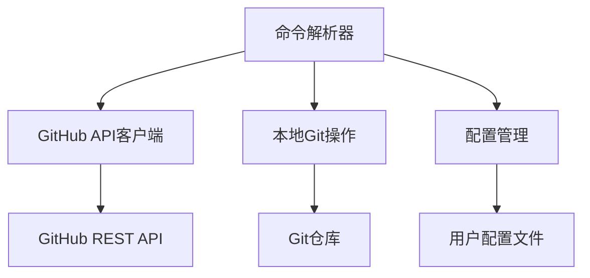

# GitHub集成 开发指南

## 架构概述

VibeCopilot的GitHub集成模块是一个命令行界面(CLI)包装器，为用户提供了与GitHub交互的简化接口。该模块位于`scripts/github`目录下，主要由以下组件组成：



## 核心组件

### 1. 命令解析器 (Command Parser)

位于 `scripts/github/project_cli.py`，负责解析用户输入的命令，验证参数，并调用相应的处理函数。

示例:
```python
def parse_args():
    parser = argparse.ArgumentParser(description='GitHub项目管理CLI')
    subparsers = parser.add_subparsers(dest='command', help='可用命令')

    # 创建项目子命令
    create_parser = subparsers.add_parser('create', help='创建新项目')
    create_parser.add_argument('--name', required=True, help='项目名称')

    # 其他子命令...

    return parser.parse_args()
```

### 2. GitHub API客户端

位于 `scripts/github/github_client.py`，封装了对GitHub API的调用，处理认证、请求发送和响应解析。

```python
class GitHubClient:
    def __init__(self, token=None):
        self.token = token or self._get_token_from_config()
        self.session = requests.Session()
        self.session.headers.update({
            'Authorization': f'token {self.token}',
            'Accept': 'application/vnd.github.v3+json'
        })

    def create_repository(self, name, description=None, private=False):
        """创建新的GitHub仓库"""
        url = 'https://api.github.com/user/repos'
        data = {
            'name': name,
            'description': description,
            'private': private
        }
        response = self.session.post(url, json=data)
        response.raise_for_status()
        return response.json()
```

### 3. 配置管理

位于 `scripts/github/config_manager.py`，负责管理用户配置，包括GitHub令牌、默认项目等。

```python
class ConfigManager:
    CONFIG_FILE = os.path.expanduser('~/.vibecopilot/github_config.json')

    def __init__(self):
        self.config = self._load_config()

    def _load_config(self):
        if os.path.exists(self.CONFIG_FILE):
            with open(self.CONFIG_FILE, 'r') as f:
                return json.load(f)
        return {'token': None, 'default_project': None}

    def save_config(self):
        os.makedirs(os.path.dirname(self.CONFIG_FILE), exist_ok=True)
        with open(self.CONFIG_FILE, 'w') as f:
            json.dump(self.config, f)
```

## 开发指南

### 添加新命令

1. 在命令解析器中注册新子命令
2. 实现命令处理函数
3. 添加文档和测试

示例：添加获取仓库详情命令

```python
# 1. 在parse_args()中添加子命令
info_parser = subparsers.add_parser('info', help='获取仓库详情')
info_parser.add_argument('--repo', required=True, help='仓库名称')

# 2. 实现处理函数
def get_repo_info(args):
    client = GitHubClient()
    repo_info = client.get_repository(args.repo)
    print(f"仓库名称: {repo_info['name']}")
    print(f"描述: {repo_info['description']}")
    print(f"URL: {repo_info['html_url']}")

# 3. 在主函数中调用
def main():
    args = parse_args()
    if args.command == 'create':
        create_repo(args)
    elif args.command == 'info':
        get_repo_info(args)
    # 其他命令...
```

### 错误处理

所有GitHub API调用应包含适当的错误处理:

```python
def safe_api_call(func):
    @functools.wraps(func)
    def wrapper(*args, **kwargs):
        try:
            return func(*args, **kwargs)
        except requests.exceptions.RequestException as e:
            if e.response and e.response.status_code == 401:
                print("错误: GitHub认证失败。请检查您的访问令牌。")
            elif e.response and e.response.status_code == 404:
                print("错误: 资源不存在。请检查项目名称或URL。")
            else:
                print(f"错误: 与GitHub通信时出现问题: {str(e)}")
            return None
    return wrapper
```

### 测试

为所有功能编写单元测试和集成测试：

```python
# 单元测试示例
def test_create_repository():
    # 使用mock模拟GitHub API响应
    with patch('requests.Session.post') as mock_post:
        mock_response = Mock()
        mock_response.json.return_value = {'name': 'test-repo', 'html_url': 'https://github.com/user/test-repo'}
        mock_post.return_value = mock_response

        client = GitHubClient('fake-token')
        result = client.create_repository('test-repo')

        assert result['name'] == 'test-repo'
        mock_post.assert_called_once()
```

## 最佳实践

1. **API限流处理**
   - 实现指数退避重试
   - 跟踪API使用限制
   - 在接近限制时延缓请求

2. **安全性考虑**
   - 安全存储访问令牌
   - 使用最小权限原则
   - 避免在日志中打印敏感信息

3. **性能优化**
   - 实现请求缓存
   - 批量处理API请求
   - 避免不必要的网络调用

4. **可扩展设计**
   - 使用抽象类和接口
   - 实现插件架构
   - 支持自定义工作流

## 集成到VibeCopilot

### 命令处理器集成

在`src/cursor/command_handler.py`中添加GitHub命令处理：

```python
def handle_command(self, command: str) -> str:
    """处理命令"""
    try:
        # 检查是否是GitHub命令
        if command.startswith('/github'):
            return self._handle_github_command(command)

        # 其他类型的命令处理...

    except Exception as e:
        logging.error(f"处理命令失败: {str(e)}")
        return f"处理命令失败: {str(e)}"

def _handle_github_command(self, command: str) -> str:
    """处理GitHub命令"""
    # 移除命令前缀并分割参数
    cmd_parts = command[8:].strip().split()

    # 构建传递给GitHub CLI的参数
    github_args = ['python', '-m', 'scripts.github.project_cli'] + cmd_parts

    # 执行命令并返回结果
    try:
        result = subprocess.run(
            github_args,
            capture_output=True,
            text=True,
            check=True
        )
        return result.stdout
    except subprocess.CalledProcessError as e:
        return f"GitHub命令执行失败: {e.stderr}"
```

## 调试与故障排除

### 启用调试日志

```python
import logging

def setup_logging(debug=False):
    level = logging.DEBUG if debug else logging.INFO
    logging.basicConfig(
        level=level,
        format='%(asctime)s - %(name)s - %(levelname)s - %(message)s'
    )
```

### 常见问题解决

1. **认证问题**
   - 检查令牌有效性
   - 验证令牌权限
   - 确认令牌未过期

2. **API错误**
   - 检查请求格式
   - 验证参数值
   - 查看GitHub API文档

3. **集成问题**
   - 确认路径配置正确
   - 检查命令格式
   - 验证环境变量设置
