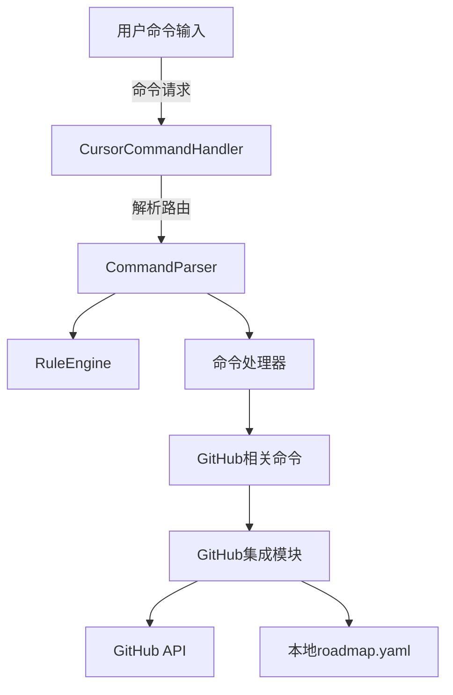

# VibeCopilot GitHub项目管理集成使用指南

## 简介

VibeCopilot GitHub项目管理集成模块利用命令系统架构，提供了一套与GitHub项目无缝协作的命令。它通过读写`roadmap.yaml`文件，实现了本地路线图与GitHub Issues/Projects的双向同步，让团队协作更高效。

## 系统架构

VibeCopilot命令系统采用分层架构设计，各组件协同工作处理GitHub集成：



## 安装与配置

### 前提条件

- 已安装Cursor IDE
- 已有GitHub账号和相关权限
- Python 3.8+

### 配置GitHub令牌

1. 生成个人访问令牌(PAT)：
   - 访问GitHub Settings -> Developer settings -> Personal access tokens
   - 生成新令牌，至少需要以下权限：`repo`, `project`
   - 复制生成的令牌

2. 配置本地环境：
   - 创建`.env`文件（如不存在）
   - 添加GitHub令牌：`GITHUB_TOKEN=your_token_here`

## 命令使用说明

### `/check` - 检查项目状态

检查并分析当前项目状态，生成或更新路线图文件。

```
/check --type=<检查类型> [--id=<任务ID>] [--update]
```

参数：

- `--type`：检查类型（必需），可选值：
  - `roadmap`：检查整体路线图
  - `task`：检查特定任务
  - `milestone`：检查里程碑
- `--id`：指定要检查的任务或里程碑ID（当type为task或milestone时必需）
- `--update`：更新路线图文件

示例：
```
/check --type=roadmap --update
```

输出：
```
🔍 项目状态检查：

当前活跃里程碑: M2 "核心功能开发阶段" (2023-12-16 至 2024-03-01)
总体进度: ██░░░░░░░░ 20%

任务统计:
- 已完成: 3 (M1阶段全部任务)
- 进行中: 1 (T2.1 "核心引擎实现")
- 待开始: 3 (当前里程碑其他任务)

路线图文件已更新: data/roadmap.yaml
```

### `/update` - 更新任务状态

更新特定任务的状态，并同步到GitHub。

```
/update --id=<任务ID> [--status=<状态>] [--github]
```

参数：

- `--id`：任务ID或名称（必需）
- `--status`：新状态，可选值：
  - `todo`：待办
  - `in_progress`：进行中
  - `completed`：已完成
- `--github`：同步到GitHub

示例：
```
/update --id=T2.1 --status=completed --github
```

输出：
```
✅ 任务更新成功!

任务: T2.1 "核心引擎实现" 已标记为已完成
所属里程碑: M2 "核心功能开发阶段"
里程碑进度已更新: 25% ↑

GitHub同步:
✓ Issue #12 状态已更新为closed
✓ 更新时间: 2024-01-15 10:30

路线图文件已更新: data/roadmap.yaml
```

### `/story` - 查看当前开发故事

查看当前开发阶段的详细信息。

```
/story [--milestone=<里程碑ID>] [--all]
```

参数：

- `--milestone`：指定里程碑ID（默认为当前活跃里程碑）
- `--all`：显示所有故事和状态

示例：
```
/story --milestone=M2
```

输出：
```
📋 当前开发阶段:

活跃里程碑: M2 "核心功能开发阶段"
时间范围: 2023-12-16 至 2024-03-01 (还剩45天)
进度: 25%

开发中任务:
- T2.2 "状态管理模块" (待开始)
- T2.3 "文档管理系统" (待开始)
- T2.4 "AI集成基础功能" (待开始)

最近完成:
- T2.1 "核心引擎实现" (已完成)

建议下一步: 开始任务T2.2
```

### `/task` - 管理任务

管理当前任务，查看任务列表或更新任务信息。

```
/task [--id=<任务ID>] [--status=<状态>] [--assignee=<用户名>] [--list]
```

参数：

- `--id`：任务ID
- `--status`：设置任务状态
- `--assignee`：指定负责人
- `--list`：列出所有未完成任务

示例：
```
/task --id=T2.2 --status=in_progress --assignee=chenyi
```

输出：
```
✅ 任务已更新!

任务ID: T2.2
标题: 状态管理模块
状态: 进行中 (之前: 待开始)
负责人: chenyi
优先级: P0
所属里程碑: M2 "核心功能开发阶段"

路线图文件已更新: data/roadmap.yaml
GitHub同步已完成: Issue #14 已更新
```

### `/plan` - 创建新计划

创建新的里程碑或任务。

```
/plan --type=[milestone|task] --title=<标题> [--milestone=<里程碑ID>] [--priority=<优先级>]
```

参数：

- `--type`：计划类型（milestone或task）
- `--title`：计划标题
- `--milestone`：所属里程碑（仅任务类型需要）
- `--priority`：优先级（P0, P1, P2, P3）

示例：
```
/plan --type=task --title="插件系统优化" --milestone=M3 --priority=P1
```

输出：
```
✅ 新任务计划已创建!

任务ID: T3.5
标题: 插件系统优化
所属里程碑: M3 "功能扩展阶段"
优先级: P1
状态: planned

路线图文件已更新: data/roadmap.yaml
GitHub同步: Issue #17已创建
```

## 路线图文件格式

路线图文件`roadmap.yaml`遵循以下格式：

```yaml
project:
  name: "VibeCopilot"
  version: "1.0.0"
  last_updated: "2024-01-10"

milestones:
  - id: "M1"
    title: "准备阶段"
    status: "completed"
    start_date: "2023-10-01"
    end_date: "2023-12-15"
    progress: 100

  - id: "M2"
    title: "核心功能开发阶段"
    status: "in_progress"
    start_date: "2023-12-16"
    end_date: "2024-03-01"
    progress: 25

tasks:
  - id: "T1.1"
    title: "项目规划与需求分析"
    milestone_id: "M1"
    status: "completed"
    priority: "P0"

  # 更多任务...
```

## 命令实现原理

### 命令处理流程

1. 用户在Cursor中输入命令（如`/check --type=roadmap`）
2. `CursorCommandHandler`接收命令并路由
3. 首先尝试使用`RuleEngine`处理命令
4. 若规则未处理，则使用`CommandParser`解析命令
5. 路由到对应的命令处理器（如`CheckCommand`）
6. 命令处理器执行具体业务逻辑
7. 返回结果给用户

### 错误处理

命令系统实现了全面的错误处理：

```python
try:
    # 命令处理逻辑
except Exception as e:
    logging.error(f"命令执行错误: {str(e)}")
    return {
        "success": False,
        "error": f"命令执行失败: {str(e)}"
    }
```

## 常见问题

### Q: 如何解决同步冲突？

A: 当本地与远程存在冲突时，系统会提示冲突细节并提供解决选项：

- 保留本地版本
- 使用远程版本
- 手动合并（推荐）

### Q: 如何批量更新任务状态？

A: 目前暂不支持批量更新。您需要逐个使用`/update`命令更新任务状态。

### Q: 如何查看完整的项目进度报告？

A: 使用`/check --type=roadmap`查看基本进度，或使用`/story --all`查看更详细的进度报告。

### Q: 命令未被识别怎么办？

A: 确保命令格式正确，包括以"/"开头。检查命令名称拼写是否正确，参数格式是否符合要求（使用`--key=value`或`--flag`格式）。

### Q: 命令执行失败如何调试？

A: 查看日志了解详细错误信息。可以使用`/check --type=debug`命令检查系统状态和配置。

## 系统集成

### 与其他模块集成

VibeCopilot命令系统已与以下模块集成：

- **GitHub模块**：实现与GitHub的数据同步
- **路线图管理**：管理项目进度和规划
- **任务跟踪**：跟踪和管理开发任务

### 与Cursor Rules集成

命令系统通过`RuleEngine`与Cursor Rules系统集成：

```
用户输入 -> CursorCommandHandler -> RuleEngine -> 命令处理
```

规则引擎优先处理命令，未匹配规则的命令才会交给命令解析器处理。

## 贡献与反馈

欢迎提交Issues或Pull Requests来改进此工具。如有问题或建议，请联系项目维护者。

---

**注意**：本工具正在积极开发中，功能可能会有变动。请定期更新以获取最新特性。
