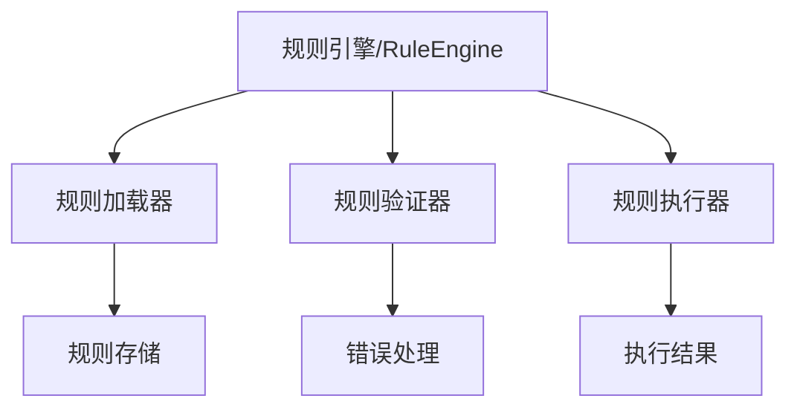

# VibeCopilot 规则系统开发指南

## 架构概述

规则系统由以下核心组件组成：



### 核心组件

1. **规则引擎 (RuleEngine)**
   - 负责规则的加载、验证和执行
   - 管理规则优先级
   - 处理规则匹配和选择

2. **规则定义**
   - YAML格式配置
   - 包含名称、模式和动作
   - 支持优先级设置

## 开发规范

### 1. 规则文件格式

```yaml
name: rule_name
pattern: /command
action:
  type: response
  message: Action message
priority: 0  # 可选，默认为0
```

### 2. 规则验证

规则必须包含以下必要字段：

- `name`: 规则名称
- `pattern`: 匹配模式
- `action`: 执行动作

验证示例：
```python
def _validate_rule(rule_def: Dict[str, Any]) -> bool:
    required_fields = ["name", "pattern", "action"]

    # 检查必要字段
    for field in required_fields:
        if field not in rule_def:
            raise RuleError(f"规则缺少必要字段: {field}")

    return True
```

### 3. 规则加载

```python
def load_rules(rules_dir: str) -> None:
    for root, _, files in os.walk(rules_dir):
        for file in files:
            if file.endswith((".yml", ".yaml")):
                with open(file_path, "r") as f:
                    rule_def = yaml.safe_load(f)
                    if validate_rule(rule_def):
                        add_rule(rule_def)
```

### 4. 规则执行

```python
def process_command(command: str) -> Dict[str, Any]:
    try:
        matching_rules = get_matching_rules(command)
        if not matching_rules:
            return {"handled": False}

        rule = matching_rules[0]  # 获取优先级最高的规则
        return execute_rule(rule)
    except Exception as e:
        return handle_error(e)
```

## 测试规范

### 1. 单元测试

每个规则组件都需要完整的单元测试：

```python
def test_validate_rule():
    """测试规则验证"""
    # 测试有效规则
    valid_rule = {
        "name": "test",
        "pattern": "/test",
        "action": {"type": "response"}
    }
    assert validate_rule(valid_rule) is True

    # 测试无效规则
    invalid_rule = {"name": "test"}
    with pytest.raises(RuleError):
        validate_rule(invalid_rule)
```

### 2. 集成测试

测试规则系统的端到端功能：

```python
def test_rule_execution():
    """测试规则执行流程"""
    engine = RuleEngine()
    engine.load_rules("test_rules")

    result = engine.process_command("/test")
    assert result["handled"] is True
    assert result["success"] is True
```

## 错误处理

### 1. 自定义异常

```python
class RuleError(Exception):
    """规则相关错误"""
    def __init__(self, message: str, code: str = "E200"):
        self.code = code
        super().__init__(f"[{code}] {message}")
```

### 2. 错误码定义

- E200: 通用规则错误
- E201: 规则加载错误
- E202: 规则验证错误
- E203: 规则执行错误

## 性能优化

1. **规则缓存**
   - 缓存已加载的规则
   - 使用LRU缓存常用规则

2. **规则索引**
   - 建立规则索引加速匹配
   - 优化规则搜索算法

3. **异步处理**
   - 异步加载规则文件
   - 并行处理规则验证

## 扩展开发

### 1. 添加新的规则类型

```python
class CustomRule(BaseRule):
    def __init__(self, rule_def: Dict[str, Any]):
        super().__init__(rule_def)
        self.custom_field = rule_def.get("custom_field")

    def execute(self, context: Dict[str, Any]) -> Dict[str, Any]:
        # 实现自定义规则逻辑
        pass
```

### 2. 实现新的规则动作

```python
@action_handler("custom_action")
def handle_custom_action(action_def: Dict[str, Any], context: Dict[str, Any]) -> Dict[str, Any]:
    # 实现自定义动作逻辑
    return {"success": True, "result": "Custom action executed"}
```

## 最佳实践

1. **规则设计原则**
   - 保持规则简单明确
   - 避免复杂的嵌套规则
   - 合理设置规则优先级

2. **代码质量**
   - 遵循PEP 8规范
   - 添加完整的类型注解
   - 编写详细的文档字符串

3. **测试覆盖**
   - 单元测试覆盖率 > 90%
   - 包含边界条件测试
   - 模拟各种错误场景

## 调试技巧

1. **日志记录**

```python
logger = logging.getLogger(__name__)
logger.info("规则执行开始: %s", rule_name)
logger.debug("规则上下文: %s", context)
```

2. **性能分析**

```python
import cProfile
profiler = cProfile.Profile()
profiler.enable()
# 执行规则
profiler.disable()
profiler.print_stats()
```

## 常见问题解决

1. **规则加载失败**
   - 检查文件权限
   - 验证YAML格式
   - 查看详细错误日志

2. **规则执行超时**
   - 优化规则匹配算法
   - 添加超时控制
   - 考虑异步执行

## 版本控制

1. **规则版本号**
   - 遵循语义化版本
   - 记录版本变更
   - 维护向后兼容

2. **变更管理**
   - 记录规则变更历史
   - 提供规则迁移工具
   - 支持规则回滚
