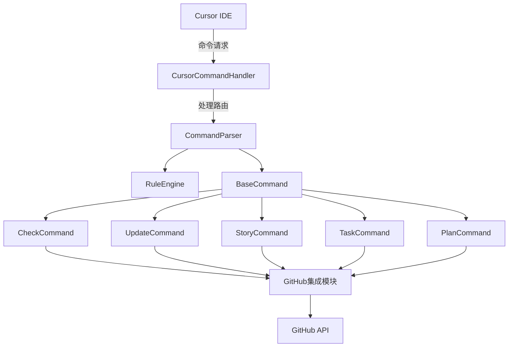

# 产品需求文档：Cursor GitHub项目管理集成

## 1. 背景与目标

### 1.1 背景

VibeCopilot项目使用Cursor命令系统进行本地开发，使用GitHub Projects进行项目管理，并通过roadmap.yaml文件定义项目进度和计划。目前这些系统独立运行，降低了开发效率，需要简单高效地集成它们。

### 1.2 目标

- 扩展现有命令处理系统，使其与GitHub项目和roadmap.yaml文件无缝协作
- 保持本地路线图与GitHub Projects数据同步
- 简化项目进度跟踪和任务管理流程
- 通过简单命令实现项目状态检查、更新和规划
- 提高团队协作效率和项目透明度

## 2. 系统架构

VibeCopilot命令系统采用分层架构设计：



## 3. 概念映射

为确保项目管理工具之间的一致性，我们建立以下简单的概念映射：

| 路线图概念 (roadmap.yaml) | GitHub概念 | 说明 |
|------------------------|-----------|--------|
| Milestone | Milestone | 项目里程碑，表示主要开发阶段 |
| Task | Issue | 具体开发任务，通过标签区分类型 |

## 4. 核心功能

### 4.1 /check 命令

- **功能**：分析本地项目进度，生成或更新标准路线图文件
- **主要操作**：
  - 读取现有项目状态
  - 更新roadmap.yaml文件
  - 显示项目进度摘要
- **参数**：
  - `--type=<检查类型>` - 指定检查类型（必需）
  - `--id=<任务ID>` - 指定要检查的任务（可选）
  - `--update` - 更新本地路线图文件
- **示例**：`/check --type=task --id=T2.1`

### 4.2 /update 命令

- **功能**：通过脚本与服务器端同步开发进度
- **主要操作**：
  - 同步本地.ai目录与roadmap.yaml（默认）
  - 同步本地数据与GitHub数据（指定github参数）
  - 解决可能的数据冲突
- **参数**：
  - `--id=<任务ID>` - 指定要更新的任务（或任务名称）
  - `--status=<状态>` - 设置任务新状态
  - `--github` - 同步到GitHub
- **示例**：`/update --id=T2.1 --status=completed --github`

### 4.3 /story 命令

- **功能**：查看当前处理的开发阶段和项目故事
- **主要操作**：
  - 显示活跃里程碑下的任务
  - 查看当前开发进度
  - 分析当前开发阶段
- **参数**：
  - `--milestone=<ID>` - 指定里程碑
  - `--all` - 显示所有故事和状态
- **示例**：`/story --milestone=M2`

### 4.4 /task 命令

- **功能**：管理当前任务，检查要完成的任务
- **主要操作**：
  - 查看当前任务状态
  - 显示未完成的issue
  - 更新任务信息
- **参数**：
  - `--id=<任务ID>` - 指定为当前任务
  - `--status=<状态>` - 设置任务状态
  - `--assignee=<用户名>` - 指定任务负责人
  - `--list` - 显示未完成任务和优先级
- **示例**：`/task --id=T2.1 --status=in_progress`

### 4.5 /plan 命令

- **功能**：制定新计划，更新本地路线图
- **主要操作**：
  - 创建新里程碑或任务
  - 设置时间线和依赖关系
  - 更新roadmap.yaml文件
- **参数**：
  - `--type=[milestone|task]` - 计划类型
  - `--title=<标题>` - 计划标题
  - `--milestone=<里程碑ID>` - 所属里程碑（仅任务类型需要）
  - `--priority=<优先级>` - 设置优先级（P0-P3）
- **示例**：`/plan --type=task --title="插件系统优化" --milestone=M3 --priority=P1`

## 5. 命令实现

所有命令处理器继承自`BaseCommand`基类，实现统一的接口和错误处理机制：

```python
class BaseCommand:
    """命令处理器基类"""

    def __init__(self, name: str, description: str):
        self.name = name
        self.description = description

    def validate_args(self, args: Dict[str, Any]) -> bool:
        """验证命令参数"""
        return True

    def execute(self, args: Dict[str, Any]) -> Dict[str, Any]:
        """执行命令"""
        if not self.validate_args(args):
            return {"success": False, "error": "参数验证失败"}

        try:
            # 子类实现具体逻辑
            return self._execute_impl(args)
        except Exception as e:
            return {"success": False, "error": str(e)}

    def _execute_impl(self, args: Dict[str, Any]) -> Dict[str, Any]:
        """命令执行的具体实现"""
        raise NotImplementedError("子类必须实现此方法")
```

## 6. 非功能需求

### 6.1 性能要求

- GitHub API调用应使用缓存减少延迟
- 同步操作应优化为增量更新
- 大型分析操作应支持后台执行

### 6.2 安全要求

- GitHub令牌安全存储，不明文显示
- 支持细粒度权限控制
- 敏感操作需确认机制

### 6.3 兼容性要求

- 与现有命令处理系统保持一致的使用体验
- 支持所有主流GitHub项目类型
- 兼容现有.ai目录结构

### 6.4 可维护性要求

- 采用模块化设计，便于扩展
- 完善的错误处理和日志记录
- 提供自诊断和故障排除功能

## 7. 用户场景

### 场景1：检查项目状态和更新路线图

```
用户: @copilot
系统: ✅ 命令模式已激活！
用户: /check --type=roadmap --update
系统:
🔍 项目状态检查：

当前活跃里程碑: M2 "核心功能开发阶段" (2023-12-16 至 2024-03-01)
总体进度: ██░░░░░░░░ 10%

任务统计:
- 已完成: 3 (M1阶段全部任务)
- 进行中: 1 (T2.1 "核心引擎实现")
- 待开始: 3 (当前里程碑其他任务)

路线图文件已更新: data/roadmap.yaml
```

### 场景2：更新任务状态和同步到GitHub

```
用户: @copilot
系统: ✅ 命令模式已激活！
用户: /update --id=T2.1 --status=completed --github
系统:
✅ 任务更新成功!

任务: T2.1 "核心引擎实现" 已标记为已完成
所属里程碑: M2 "核心功能开发阶段"
里程碑进度已更新: 25% ↑

GitHub同步:
✓ Issue #12 状态已更新为closed
✓ 更新时间: 2024-01-15 10:30

路线图文件已更新: data/roadmap.yaml
```

### 场景3：查看当前开发阶段

```
用户: @copilot
系统: ✅ 命令模式已激活！
用户: /story
系统:
📋 当前开发阶段:

活跃里程碑: M2 "核心功能开发阶段"
时间范围: 2023-12-16 至 2024-03-01 (还剩45天)
进度: 25%

开发中任务:
- T2.2 "状态管理模块" (待开始)
- T2.3 "文档管理系统" (待开始)
- T2.4 "AI集成基础功能" (待开始)

最近完成:
- T2.1 "核心引擎实现" (刚刚完成)

建议下一步: 开始任务T2.2
```

### 场景4：管理当前任务

```
用户: @copilot
系统: ✅ 命令模式已激活！
用户: /task --id=T2.2 --status=in_progress --assignee=chenyi
系统:
✅ 任务已更新!

任务ID: T2.2
标题: 状态管理模块
状态: 进行中 (之前: 待开始)
负责人: chenyi
优先级: P0
所属里程碑: M2 "核心功能开发阶段"

路线图文件已更新: data/roadmap.yaml
GitHub同步已完成: Issue #14 已更新
```

### 场景5：制定新计划

```
用户: @copilot
系统: ✅ 命令模式已激活！
用户: /plan --type=task --title="插件系统优化" --milestone=M3 --priority=P1
系统:
✅ 新任务计划已创建!

任务ID: T3.5
标题: 插件系统优化
所属里程碑: M3 "功能扩展阶段"
优先级: P1
状态: planned

路线图文件已更新: data/roadmap.yaml
GitHub同步: Issue #17已创建
```

## 8. 实现计划

### 8.1 阶段1：基础架构

- 实现基础命令处理系统
- 创建BaseCommand基类和CommandParser
- 构建RuleEngine与命令系统的集成
- 实现错误处理和日志系统

### 8.2 阶段2：核心功能

- 实现CheckCommand和UpdateCommand
- 实现roadmap.yaml文件读写操作
- 开发GitHub API基础集成
- 实现简单的同步功能

### 8.3 阶段3：功能扩展

- 实现StoryCommand、TaskCommand和PlanCommand
- 增强GitHub集成功能
- 实现冲突解决机制
- 添加更多功能选项

## 9. 验收标准

- 所有命令能正确处理roadmap.yaml文件
- 命令能正确执行并返回预期结果
- 本地修改能准确同步到GitHub
- GitHub变更能同步到本地路线图
- 命令响应及时，操作简单直观
- 冲突情况有清晰提示和解决方案
- 测试覆盖率达到80%以上

## 10. 风险与缓解

| 风险 | 可能性 | 影响 | 缓解措施 |
|------|--------|------|----------|
| GitHub API限制 | 高 | 中 | 实现本地缓存减少API调用 |
| 路线图文件冲突 | 中 | 高 | 实现文件版本对比和冲突解决 |
| 数据格式变更 | 低 | 高 | 设计灵活的数据解析和迁移机制 |
| 命令解析错误 | 中 | 中 | 完善参数验证和错误处理 |
| 规则引擎冲突 | 低 | 高 | 实现规则优先级和冲突解决 |
