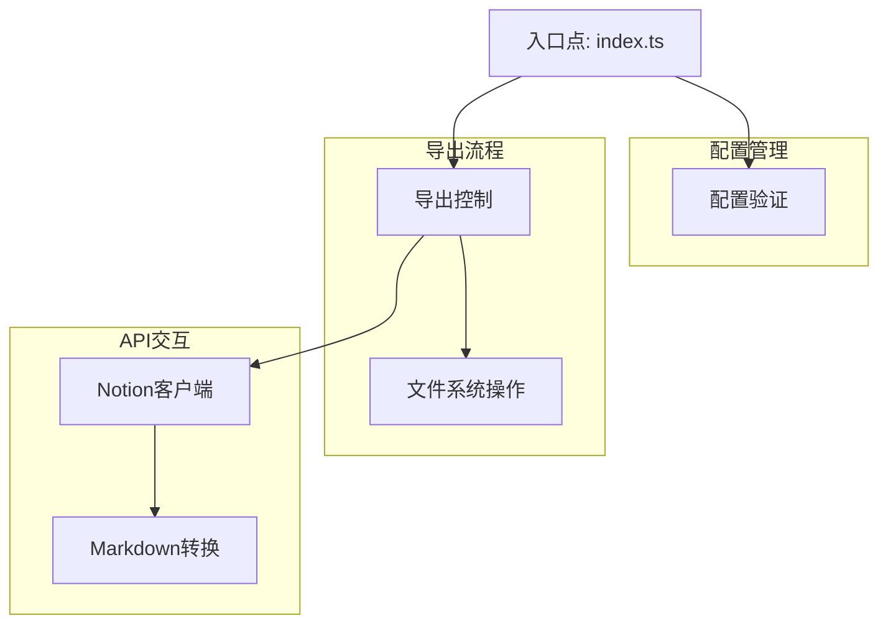
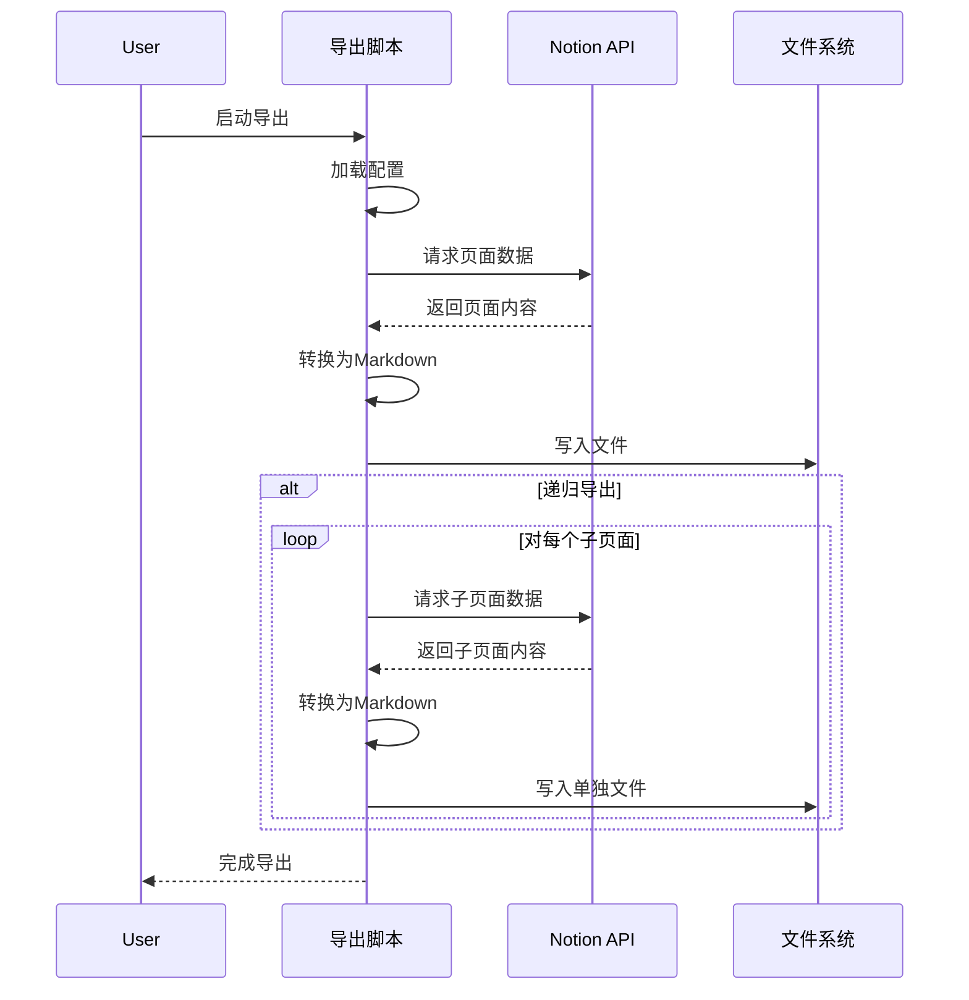
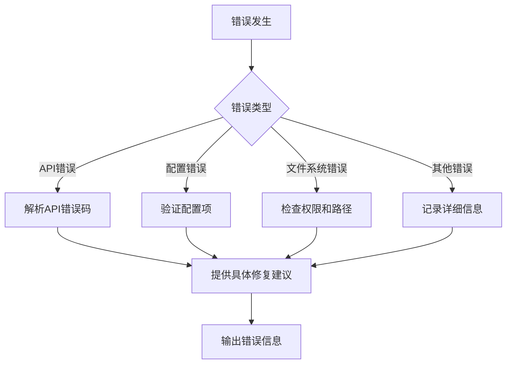

# Notion导出工具技术架构

## 整体架构

Notion导出工具采用模块化设计，遵循单一职责原则，将不同功能分离到独立模块中。系统架构如下图所示：



## 核心模块说明

### 1. 入口模块 (index.ts)

入口模块负责解析环境变量和命令行参数，构建配置对象，并启动导出流程。

```typescript
// 简化示例
import { NotionExportConfig } from './types.js';
import { exportNotionPage } from './exporter.js';

// 构建配置
const config: NotionExportConfig = {
  apiKey: process.env.NOTION_API_KEY || '',
  pageId: process.env.NOTION_PAGE_ID || '',
  outputFilename: process.env.OUTPUT_FILENAME || 'exported_notion_page.md',
  outputDir: process.env.OUTPUT_DIR || 'exports',
  recursive: process.env.RECURSIVE === 'true',
  maxDepth: parseInt(process.env.MAX_DEPTH || '3'),
  usePageTitleAsFilename: process.env.USE_PAGE_TITLE_AS_FILENAME === 'true'
};

// 启动导出
exportNotionPage(config);
```

### 2. 类型定义 (types.ts)

定义系统中使用的所有类型和接口，确保类型安全。

```typescript
export interface NotionExportConfig {
  apiKey: string;
  pageId: string;
  outputFilename: string;
  outputDir: string;
  recursive: boolean;
  maxDepth: number;
  usePageTitleAsFilename: boolean;
}

export interface ExportResult {
  pageId: string;
  title: string;
  filename: string;
  path: string;
  subpages: SubpageInfo[];
}

export interface SubpageInfo {
  id: string;
  title: string;
}
```

### 3. 导出控制器 (exporter.ts)

负责导出流程控制，包括递归导出和文件写入。

```typescript
// 简化示例
export async function exportNotionPage(config: NotionExportConfig): Promise<void> {
  try {
    // 验证配置
    validateConfig(config);

    // 确保输出目录存在
    await ensureDirectoryExists(config.outputDir);

    if (config.recursive) {
      // 递归导出
      await exportPageRecursive(config);
    } else {
      // 单页面导出
      const result = await exportSinglePage(config);
      if (result) {
        console.log(`导出成功: ${result.path}`);
      }
    }
  } catch (error) {
    console.error('导出失败:', error);
  }
}
```

### 4. Notion客户端 (notion-client.ts)

封装与Notion API的交互，处理页面获取和错误处理。

```typescript
// 简化示例
export async function exportPage(config: NotionExportConfig): Promise<ExportResult | null> {
  const notion = new Client({ auth: config.apiKey });
  const notionToMd = new NotionConverter({ notionClient: notion });

  try {
    // 获取页面信息
    const page = await notion.pages.retrieve({ page_id: config.pageId });

    // 获取页面内容
    const mdBlocks = await notionToMd.pageToMarkdown(config.pageId);

    // 转换为Markdown
    const mdString = convertToMarkdown(mdBlocks);

    // 提取标题
    const title = extractTitle(page);

    // 生成文件名
    const filename = config.usePageTitleAsFilename
      ? generateSafeFilename(title, config.pageId)
      : config.outputFilename;

    // 写入文件
    const outputPath = path.join(config.outputDir, filename);
    await fs.writeFile(outputPath, mdString, 'utf8');

    // 提取子页面信息
    const subpages = extractSubpages(mdBlocks);

    return {
      pageId: config.pageId,
      title,
      filename,
      path: outputPath,
      subpages
    };
  } catch (error) {
    handleApiError(error);
    return null;
  }
}
```

### 5. Markdown转换器 (markdown-converter.ts)

处理Notion块到Markdown的转换逻辑。

```typescript
// 简化示例
export function convertToMarkdown(mdBlocks: any[]): string {
  // 处理特殊块类型
  const processedBlocks = mdBlocks.map(block => {
    // 处理子页面链接
    if (block.type === 'child_page') {
      return `[📑 ${block.title}](${block.id})\n\n`;
    }

    // 处理其他块类型
    return block.parent;
  });

  // 合并为单个字符串
  return processedBlocks.join('');
}
```

### 6. 工具函数 (utils.ts)

提供各种辅助功能，如配置验证、文件名生成等。

```typescript
// 简化示例
export function extractSubpages(mdBlocks: any[]): SubpageInfo[] {
  const subpages: SubpageInfo[] = [];

  mdBlocks.forEach(block => {
    if (block.type === 'child_page') {
      subpages.push({
        id: block.id,
        title: block.title
      });
    }
  });

  return subpages;
}

export function generateSafeFilename(title: string, pageId: string): string {
  // 移除不安全字符
  const safeTitle = title
    .replace(/[/\\?%*:|"<>]/g, '-')
    .replace(/\s+/g, '-')
    .substring(0, 100);

  // 添加页面ID前8位作为唯一标识
  return `${safeTitle}-${pageId.substring(0, 8)}.md`;
}
```

## 数据流

系统中的数据流如下图所示：



## 错误处理策略

系统采用多层次错误处理策略：

1. **API错误处理**：捕获并解析Notion API返回的错误
2. **配置验证**：在执行前验证所有必要配置
3. **文件系统错误处理**：处理文件写入和目录创建错误
4. **递归深度控制**：防止无限递归导致的栈溢出



## 性能考量

1. **并发控制**：递归导出时使用并发限制，避免API限流
2. **内存管理**：流式处理大型页面，避免内存溢出
3. **缓存策略**：缓存已获取的页面数据，减少重复请求

## 扩展性设计

系统设计考虑了未来可能的扩展：

1. **插件系统**：预留了转换器扩展点，支持自定义块处理
2. **输出格式**：可扩展支持其他输出格式（如HTML、PDF）
3. **批量处理**：支持批量导出多个页面

## 代码质量保证

1. **类型安全**：使用TypeScript强类型确保类型安全
2. **模块化**：每个模块职责单一，代码量控制在200行以内
3. **错误处理**：全面的错误处理和日志记录
4. **命名规范**：遵循项目命名规范，提高代码可读性
