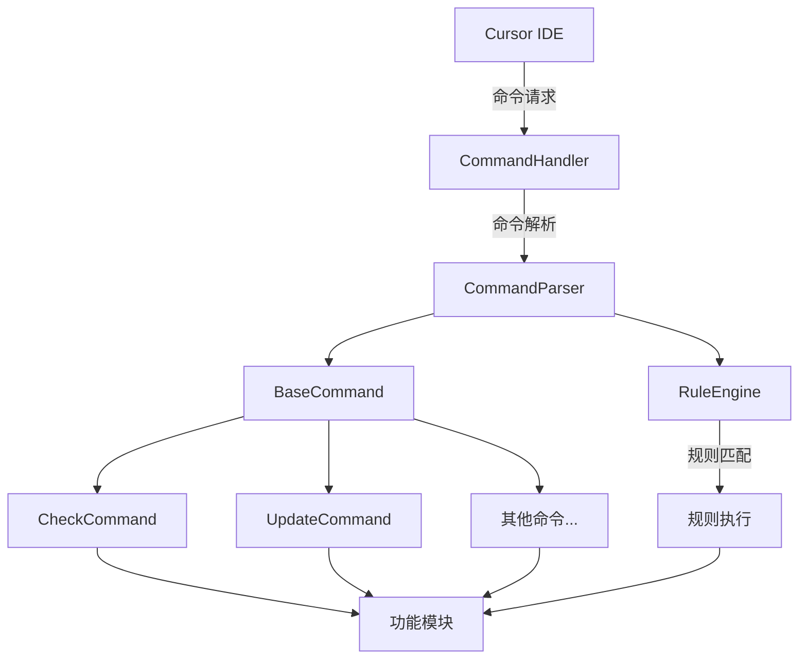

# VibeCopilot 命令系统实现指南

## 1. 背景与目标

VibeCopilot命令系统是连接Cursor IDE与项目核心功能的关键接口层。它负责接收来自Cursor的命令请求，解析命令结构，验证参数，并调用相应的功能模块执行操作。通过这种设计，用户可以直接在Cursor中使用简单命令触发复杂功能。

### 1.1 目标

- 构建统一的命令处理框架，接收Cursor Rules系统的调用
- 提供标准化的命令解析和路由机制
- 实现可扩展的命令处理器架构
- 确保命令执行的可靠性和错误处理
- 简化新命令的添加和管理

## 2. 系统架构

命令系统采用分层架构设计，包括：



### 2.1 核心组件

1. **CursorCommandHandler**：接收来自Cursor的命令请求，初步处理并路由
2. **CommandParser**：解析命令字符串，提取命令名称和参数
3. **RuleEngine**：处理基于规则的命令
4. **BaseCommand**：所有命令处理器的基类
5. **具体命令处理器**：实现特定命令的处理逻辑

## 3. 命令处理流程

### 3.1 命令接收

当用户在Cursor中输入命令（如`/check --type=task`）时，Cursor通过调用VibeCopilot的命令处理接口传递该命令：

```python
def handle_command(self, command: str) -> Dict[str, Any]:
    """处理来自Cursor的命令请求"""
    try:
        # 首先尝试通过规则引擎处理命令
        rule_result = self.rule_engine.process_command(command)
        if rule_result["handled"]:
            return rule_result

        # 规则引擎未处理，使用命令解析器
        result = self.command_parser.execute_command(command)
        return result
    except Exception as e:
        logging.error(f"处理命令失败: {str(e)}")
        return {"success": False, "error": f"处理命令失败: {str(e)}"}
```

### 3.2 命令解析

命令解析器负责将命令字符串转换为结构化数据：

```python
def parse_command(self, command_str: str) -> Tuple[str, Dict[str, Any]]:
    """解析命令字符串，返回命令名称和参数字典"""
    if not command_str.startswith("/"):
        raise ValueError("命令必须以'/'开头")

    parts = command_str[1:].strip().split()
    if not parts:
        raise ValueError("无效的命令格式")

    command_name = parts[0]
    args = {}

    # 解析参数
    for part in parts[1:]:
        if part.startswith("--"):
            if "=" in part:
                key, value = part[2:].split("=", 1)
                args[key] = value
            else:
                args[part[2:]] = True

    return command_name, args
```

### 3.3 命令执行

解析后的命令被路由到相应的命令处理器：

```python
def execute_command(self, command_str: str) -> Dict[str, Any]:
    """执行命令字符串"""
    try:
        command_name, args = self.parse_command(command_str)

        if command_name not in self.commands:
            return {"success": False, "error": f"未知命令: {command_name}"}

        # 获取命令处理器并执行
        command_handler = self.commands[command_name]
        return command_handler.execute(args)

    except Exception as e:
        logging.error(f"执行命令失败: {str(e)}")
        return {"success": False, "error": f"处理命令失败: {str(e)}"}
```

## 4. 命令处理器实现

所有命令处理器都继承自`BaseCommand`基类：

```python
class BaseCommand:
    """命令处理器基类"""

    def __init__(self, name: str, description: str):
        self.name = name
        self.description = description

    def validate_args(self, args: Dict[str, Any]) -> bool:
        """验证命令参数"""
        return True

    def execute(self, args: Dict[str, Any]) -> Dict[str, Any]:
        """执行命令"""
        if not self.validate_args(args):
            return {"success": False, "error": "参数验证失败"}

        try:
            # 子类实现具体逻辑
            return self._execute_impl(args)
        except Exception as e:
            return {"success": False, "error": str(e)}

    def _execute_impl(self, args: Dict[str, Any]) -> Dict[str, Any]:
        """命令执行的具体实现"""
        raise NotImplementedError("子类必须实现此方法")
```

### 4.1 检查命令示例

```python
class CheckCommand(BaseCommand):
    """检查命令处理器"""

    def __init__(self):
        super().__init__("check", "检查项目状态")

    def validate_args(self, args: Dict[str, Any]) -> bool:
        """验证检查命令的参数"""
        # 验证type参数是否存在
        if "type" not in args:
            return False
        return True

    def _execute_impl(self, args: Dict[str, Any]) -> Dict[str, Any]:
        """执行检查命令"""
        check_type = args.get("type")
        task_id = args.get("id")

        logging.info(f"执行检查命令：类型={check_type}, 任务ID={task_id}")

        # 实际执行检查逻辑
        # ...

        return {
            "success": True,
            "message": f"检查完成：{check_type}",
            "data": {
                "type": check_type,
                "id": task_id
            }
        }
```

## 5. 与Cursor Rules的集成

VibeCopilot命令系统通过规则引擎`RuleEngine`与Cursor Rules系统集成。规则引擎负责解析和执行基于规则的命令。

### 5.1 规则引擎实现

```python
class RuleEngine:
    """规则引擎类"""

    def __init__(self):
        """初始化规则引擎"""
        self.rules = {}
        self.rule_priorities = {}
        self._initialize_rules()

    def process_command(self, command: str) -> Dict[str, Any]:
        """处理命令，返回处理结果"""
        try:
            matching_rules = self.get_matching_rules(command)

            if not matching_rules:
                return {"handled": False}

            # 执行优先级最高的规则
            rule = matching_rules[0]
            logging.info(f"使用规则 {rule['name']} 处理命令")

            return {
                "handled": True,
                "success": True,
                "rule": rule["name"],
                "action": rule["action"]
            }

        except Exception as e:
            error_msg = f"规则引擎处理失败: {str(e)}"
            logging.error(error_msg)
            return {
                "handled": True,
                "success": False,
                "error": error_msg
            }
```

### 5.2 规则匹配与执行

规则引擎根据命令内容匹配相应的规则，并按优先级执行最匹配的规则：

```python
def get_matching_rules(self, command: str) -> List[Dict[str, Any]]:
    """获取匹配的规则列表"""
    matching_rules = []
    for name, rule in self.rules.items():
        if rule["pattern"] in command:
            matching_rules.append((name, rule))

    # 按优先级排序
    return [
        rule for _, rule in sorted(
            matching_rules,
            key=lambda x: self.rule_priorities[x[0]],
            reverse=True
        )
    ]
```

## 6. 注册和发现命令

为确保系统可扩展性，命令注册采用自动化机制：

```python
def _register_default_commands(self):
    """注册默认命令处理器"""
    self.register_command(CheckCommand())
    self.register_command(UpdateCommand())
    # 注册其他命令...

def register_command(self, command: BaseCommand):
    """注册命令处理器"""
    self.commands[command.name] = command
    logging.info(f"已注册命令: {command.name}")
```

## 7. 错误处理与日志

命令系统实现了全面的错误处理和日志记录：

```python
# 错误处理
try:
    # 命令处理逻辑
except Exception as e:
    logging.error(f"命令执行错误: {str(e)}", exc_info=True)
    return {
        "success": False,
        "error": f"命令执行失败: {str(e)}",
        "error_type": type(e).__name__
    }

# 日志记录
logging.info(f"收到命令: {command}")
logging.debug(f"命令参数: {args}")
```

## 8. 集成示例

### 8.1 接收Cursor命令

```
用户在Cursor中: @copilot /check --type=task --id=T2.1
```

### 8.2 处理流程

1. Cursor调用`CursorCommandHandler.handle_command`
2. 命令处理器尝试使用规则引擎处理命令
3. 若规则引擎未处理，则使用命令解析器解析命令
4. 命令解析器提取命令名称"check"和参数`{"type":"task", "id":"T2.1"}`
5. 路由到`CheckCommand`处理器
6. `CheckCommand`执行检查逻辑并返回结果
7. 结果返回给Cursor呈现给用户

### 8.3 响应示例

```json
{
  "success": true,
  "message": "检查完成：task",
  "data": {
    "type": "task",
    "id": "T2.1",
    "status": "in_progress",
    "milestone": "M2",
    "completion": "35%"
  }
}
```

## 9. 扩展命令系统

### 9.1 添加新命令

创建新的命令处理器只需几个简单步骤：

1. 创建新的命令类继承`BaseCommand`
2. 实现`_execute_impl`方法
3. 在命令解析器中注册新命令

```python
# 1. 创建新命令类
class StoryCommand(BaseCommand):
    def __init__(self):
        super().__init__("story", "查看当前开发故事")

    def _execute_impl(self, args: Dict[str, Any]) -> Dict[str, Any]:
        # 实现story命令逻辑
        milestone = args.get("milestone")
        # ...处理逻辑...
        return {"success": True, "data": {...}}

# 2. 注册命令
def _register_default_commands(self):
    # ...其他命令...
    self.register_command(StoryCommand())
```

### 9.2 处理特殊命令参数

某些命令可能需要特殊参数处理：

```python
def validate_args(self, args: Dict[str, Any]) -> bool:
    """验证命令参数并处理特殊情况"""
    # 必需参数检查
    if "type" not in args:
        return False

    # 参数转换
    if "priority" in args:
        priority_map = {"high": "P0", "medium": "P1", "low": "P2"}
        args["priority"] = priority_map.get(args["priority"], args["priority"])

    return True
```

## 10. 后续发展

### 10.1 计划改进

- 添加参数类型转换支持
- 实现命令别名机制
- 添加交互式命令支持
- 实现命令权限控制
- 添加命令执行历史记录

### 10.2 与其他系统集成

- GitHub项目管理集成
- 本地开发环境集成
- 路线图管理系统
- AI辅助功能

## 11. 故障排除

### 11.1 常见问题

- **命令未识别**: 确认命令格式是否正确，包括前缀"/"
- **参数解析错误**: 检查参数格式是否遵循"--key=value"或"--flag"
- **执行失败**: 查看日志了解详细错误信息

### 11.2 调试技巧

- 使用详细日志模式: `logging.setLevel(logging.DEBUG)`
- 检查命令注册状态: `print(command_parser.commands.keys())`
- 测试规则匹配: `print(rule_engine.get_matching_rules(command))`
