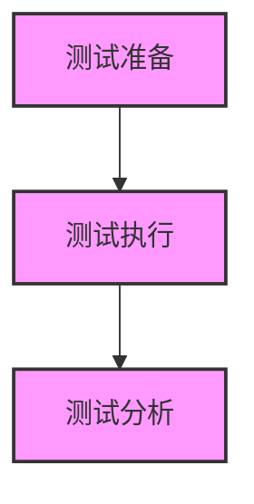

# VibeCopilot 工作流命令参考

本文档提供了 VibeCopilot 工作流模块所有命令和参数的详细参考。

## 主命令

### flow

管理和执行工作流的主命令。

```bash
vibecopilot flow <子命令> [参数]
```

## 子命令

### list

列出所有可用的工作流。

```bash
vibecopilot flow list
```

**参数：** 无

**示例：**
```bash
vibecopilot flow list
```

**输出：**
```
找到 2 个工作流:
  - test-workflow: 测试工作流
    描述: 基于test-flow规则生成的测试流程工作流
    来源: .cursor/rules/flow-rules/test-flow.mdc

  - coding-workflow: 编码工作流
    描述: 代码开发流程，包括设计、实现和测试
    来源: .cursor/rules/flow-rules/coding-flow.mdc
```

### create

从规则文件创建新的工作流。

```bash
vibecopilot flow create <rule_path> [--output OUTPUT]
```

**参数：**

- `rule_path`：规则文件路径（必填）
- `--output, -o`：输出文件路径（可选）

**示例：**
```bash
vibecopilot flow create .cursor/rules/flow-rules/test-flow.mdc
vibecopilot flow create .cursor/rules/flow-rules/custom-flow.mdc --output custom-workflow.json
```

**输出：**
```
已从规则创建工作流: test-workflow
工作流已保存到: ~/Public/VibeCopilot/src/workflow/workflows/test-workflow.json

工作流Mermaid图:

```

### view

查看工作流的详细信息。

```bash
vibecopilot flow view <workflow_id> [--format {json,mermaid}]
```

**参数：**

- `workflow_id`：工作流ID（必填）
- `--format, -f`：输出格式，可选 `json` 或 `mermaid`，默认为 `json`

**示例：**
```bash
vibecopilot flow view test-workflow
vibecopilot flow view test-workflow --format mermaid
```

**输出（JSON格式）：**
```json
{
  "id": "test-workflow",
  "name": "测试工作流",
  "description": "基于test-flow规则生成的测试流程工作流",
  "version": "1.0.0",
  "source_rule": ".cursor/rules/flow-rules/test-flow.mdc",
  "stages": [
    {
      "id": "test_preparation",
      "name": "测试准备",
      "description": "准备测试环境和测试计划",
      "order": 0,
      "checklist": [
        "理解需要测试的功能和预期行为",
        "准备测试环境和测试数据",
        "确认测试工具和框架可用",
        "制定测试计划和测试用例"
      ],
      "deliverables": [
        "测试计划文档",
        "测试用例列表",
        "测试环境配置完成"
      ]
    },
    // 更多阶段...
  ],
  "transitions": [
    // 阶段转换...
  ]
}
```

### context

获取工作流的上下文信息，包括当前阶段、进度和下一步任务。

```bash
vibecopilot flow context <workflow_id> [--stage STAGE] [--completed COMPLETED [COMPLETED ...]]
```

**参数：**

- `workflow_id`：工作流ID（必填）
- `--stage, -s`：当前阶段ID（可选）
- `--completed, -c`：已完成的检查项列表（可选，可多个）

**示例：**
```bash
vibecopilot flow context test-workflow
vibecopilot flow context test-workflow --stage test_execution
vibecopilot flow context test-workflow --stage test_execution --completed "执行单元测试并验证覆盖率"
```

**输出：**
```json
{
  "workflow": {
    "id": "test-workflow",
    "name": "测试工作流",
    "description": "基于test-flow规则生成的测试流程工作流",
    "source_rule": ".cursor/rules/flow-rules/test-flow.mdc",
    "total_stages": 3
  },
  "current_stage": {
    "stage_id": "test_execution",
    "stage_name": "测试执行",
    "stage_description": "执行各类测试并记录结果",
    "stage_order": 1,
    "progress": 25.0,
    "checklist": [
      {
        "text": "执行单元测试并验证覆盖率",
        "completed": true
      },
      {
        "text": "执行集成测试验证组件交互",
        "completed": false
      },
      {
        "text": "执行端到端测试验证整体功能",
        "completed": false
      },
      {
        "text": "记录测试过程和发现的问题",
        "completed": false
      }
    ],
    "deliverables": [
      "测试执行记录",
      "测试覆盖率报告",
      "问题跟踪记录"
    ]
  },
  "next_tasks": [
    {
      "text": "执行集成测试验证组件交互",
      "priority": "high",
      "stage_id": "test_execution"
    },
    {
      "text": "执行端到端测试验证整体功能",
      "priority": "high",
      "stage_id": "test_execution"
    },
    {
      "text": "记录测试过程和发现的问题",
      "priority": "high",
      "stage_id": "test_execution"
    }
  ],
  "next_stages": [
    {
      "stage_id": "test_analysis",
      "stage_name": "测试分析",
      "stage_description": "分析测试结果并提出改进建议",
      "stage_order": 2
    }
  ]
}
```

### export

将工作流导出为不同格式。

```bash
vibecopilot flow export <workflow_id> [--format {json,mermaid}] [--output OUTPUT]
```

**参数：**

- `workflow_id`：工作流ID（必填）
- `--format, -f`：导出格式，可选 `json` 或 `mermaid`，默认为 `json`
- `--output, -o`：输出文件路径（可选）

**示例：**
```bash
vibecopilot flow export test-workflow
vibecopilot flow export test-workflow --format mermaid --output test-flow.md
```

**输出（到文件或控制台）：**


## 流程类型命令

以下命令用于执行特定类型的工作流。它们会自动加载或创建对应的工作流，并提供当前进度和下一步指引。

### story

执行故事流程，用于产品需求分析和用户故事开发。

```bash
vibecopilot flow story [--stage STAGE] [--completed COMPLETED [COMPLETED ...]]
```

**参数：**

- `--stage, -s`：当前阶段ID（可选）
- `--completed, -c`：已完成的检查项列表（可选，可多个）

**示例：**
```bash
vibecopilot flow story
vibecopilot flow story --stage story_refinement
```

### spec

执行规格流程，用于技术方案设计和规格说明。

```bash
vibecopilot flow spec [--stage STAGE] [--completed COMPLETED [COMPLETED ...]]
```

**参数：**

- `--stage, -s`：当前阶段ID（可选）
- `--completed, -c`：已完成的检查项列表（可选，可多个）

**示例：**
```bash
vibecopilot flow spec
vibecopilot flow spec --stage tech_selection
```

### coding

执行编码流程，用于代码实现和单元测试。

```bash
vibecopilot flow coding [--stage STAGE] [--completed COMPLETED [COMPLETED ...]]
```

**参数：**

- `--stage, -s`：当前阶段ID（可选）
- `--completed, -c`：已完成的检查项列表（可选，可多个）

**示例：**
```bash
vibecopilot flow coding
vibecopilot flow coding --stage code_implementation --completed "搭建基本结构"
```

### test

执行测试流程，用于功能测试和质量验证。

```bash
vibecopilot flow test [--stage STAGE] [--completed COMPLETED [COMPLETED ...]]
```

**参数：**

- `--stage, -s`：当前阶段ID（可选）
- `--completed, -c`：已完成的检查项列表（可选，可多个）

**示例：**
```bash
vibecopilot flow test
vibecopilot flow test --stage test_execution --completed "执行单元测试并验证覆盖率"
```

**输出：**
```
当前工作流: 测试工作流
当前阶段: 测试执行
阶段描述: 执行各类测试并记录结果
进度: 25.0%

📋 检查清单:
✅ 执行单元测试并验证覆盖率
⬜ 执行集成测试验证组件交互
⬜ 执行端到端测试验证整体功能
⬜ 记录测试过程和发现的问题

📦 交付物:
📄 测试执行记录
📄 测试覆盖率报告
📄 问题跟踪记录

⏭️ 下一步任务:
🔴 执行集成测试验证组件交互
🔴 执行端到端测试验证整体功能
🔴 记录测试过程和发现的问题

工作流程图:

```

### review

执行审查流程，用于代码审查和文档审核。

```bash
vibecopilot flow review [--stage STAGE] [--completed COMPLETED [COMPLETED ...]]
```

**参数：**

- `--stage, -s`：当前阶段ID（可选）
- `--completed, -c`：已完成的检查项列表（可选，可多个）

**示例：**
```bash
vibecopilot flow review
vibecopilot flow review --stage code_review
```

### commit

执行提交流程，用于代码提交和版本控制。

```bash
vibecopilot flow commit [--stage STAGE] [--completed COMPLETED [COMPLETED ...]]
```

**参数：**

- `--stage, -s`：当前阶段ID（可选）
- `--completed, -c`：已完成的检查项列表（可选，可多个）

**示例：**
```bash
vibecopilot flow commit
vibecopilot flow commit --stage prepare_commit
```

## 命令参数表

| 命令 | 子命令 | 参数 | 参数类型 | 必填 | 默认值 | 描述 |
|------|--------|------|----------|------|--------|------|
| flow | list | - | - | - | - | 列出所有工作流 |
| flow | create | rule_path | string | 是 | - | 规则文件路径 |
| flow | create | --output, -o | string | 否 | 自动生成 | 输出文件路径 |
| flow | view | workflow_id | string | 是 | - | 工作流ID |
| flow | view | --format, -f | string | 否 | json | 输出格式 (json/mermaid) |
| flow | context | workflow_id | string | 是 | - | 工作流ID |
| flow | context | --stage, -s | string | 否 | - | 当前阶段ID |
| flow | context | --completed, -c | list | 否 | [] | 已完成的检查项列表 |
| flow | export | workflow_id | string | 是 | - | 工作流ID |
| flow | export | --format, -f | string | 否 | json | 导出格式 (json/mermaid) |
| flow | export | --output, -o | string | 否 | - | 输出文件路径 |
| flow | story | --stage, -s | string | 否 | - | 当前阶段ID |
| flow | story | --completed, -c | list | 否 | [] | 已完成的检查项列表 |
| flow | spec | --stage, -s | string | 否 | - | 当前阶段ID |
| flow | spec | --completed, -c | list | 否 | [] | 已完成的检查项列表 |
| flow | coding | --stage, -s | string | 否 | - | 当前阶段ID |
| flow | coding | --completed, -c | list | 否 | [] | 已完成的检查项列表 |
| flow | test | --stage, -s | string | 否 | - | 当前阶段ID |
| flow | test | --completed, -c | list | 否 | [] | 已完成的检查项列表 |
| flow | review | --stage, -s | string | 否 | - | 当前阶段ID |
| flow | review | --completed, -c | list | 否 | [] | 已完成的检查项列表 |
| flow | commit | --stage, -s | string | 否 | - | 当前阶段ID |
| flow | commit | --completed, -c | list | 否 | [] | 已完成的检查项列表 |

## 错误代码

| 状态码 | 描述 |
|--------|------|
| 0 | 命令执行成功 |
| 1 | 一般性错误 |
| 2 | 找不到规则文件 |
| 3 | 找不到工作流 |
| 4 | 解析规则失败 |
| 5 | 创建工作流失败 |
| 6 | 保存工作流失败 |

## 环境变量

| 环境变量 | 描述 | 默认值 |
|----------|------|--------|
| VIBECOPILOT_WORKFLOW_DIR | 工作流存储目录 | src/workflow/workflows |
| VIBECOPILOT_TEMPLATE_DIR | 工作流模板目录 | src/workflow/templates/flow_templates |
| VIBECOPILOT_RULE_DIR | 规则文件目录 | .cursor/rules/flow-rules |
| VIBECOPILOT_LOG_LEVEL | 日志级别 | INFO |

## Cursor 斜杠命令

在 Cursor IDE 中，以下斜杠命令可用于快速访问工作流功能：

| 斜杠命令 | 等效 CLI 命令 | 描述 |
|----------|--------------|------|
| /flow list | vibecopilot flow list | 列出所有工作流 |
| /flow create <rule_path> | vibecopilot flow create <rule_path> | 从规则创建工作流 |
| /flow test | vibecopilot flow test | 执行测试流程 |
| /flow coding | vibecopilot flow coding | 执行编码流程 |
| /flow <type> | vibecopilot flow <type> | 执行特定类型的流程 |
| /help flow | vibecopilot help flow | 显示流程命令帮助 |

---

若有疑问或需要进一步的支持，请参考用户指南或开发者指南，或联系开发团队。
