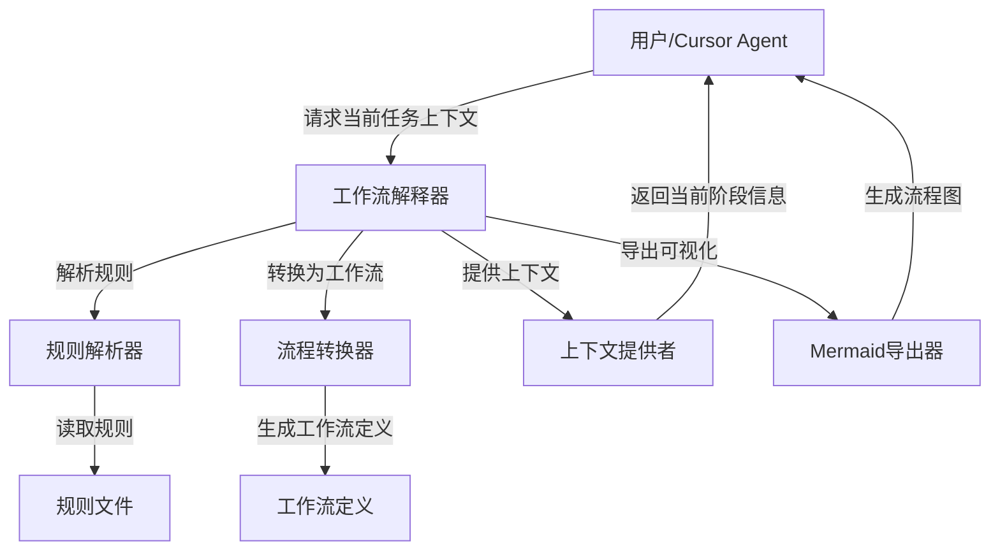
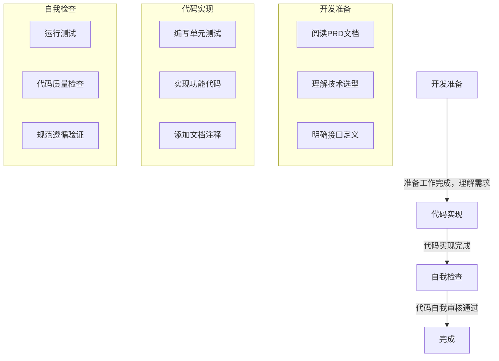

# Workflow 本地实现设计

## 1. 设计目标

设计一个轻量级的工作流引导解释器，用于实现以下目标：

- 将 VibeCopilot 开发生命周期中的流程规则（flow-rules）转换为结构化的工作流定义
- 为 Cursor Agent 提供上下文和引导，说明当前工作阶段、已完成内容和下一步任务
- 跟踪开发进度并提供相应的检查清单和交付物要求
- 保持与现有 n8n 集成的兼容性，将实际的工作流执行交给 n8n
- 使用 Mermaid 语法可视化工作流程

## 2. 系统架构

### 2.1 核心组件

```
workflow/
├── interpreter/                   # 工作流解释器模块
│   ├── __init__.py
│   ├── rule_parser.py            # 规则解析器
│   ├── flow_converter.py         # 规则到工作流转换器
│   └── context_provider.py       # 上下文提供者
├── models/                        # 工作流数据模型
│   ├── __init__.py
│   ├── workflow_definition.py    # 工作流定义模型
│   └── workflow_context.py       # 工作流上下文模型
├── exporters/                     # 工作流导出模块
│   ├── __init__.py
│   ├── mermaid_exporter.py       # Mermaid导出工具
│   └── json_exporter.py          # JSON导出工具
└── templates/                     # 工作流模板定义
    ├── __init__.py
    └── flow_templates/           # 基于规则的模板定义
        ├── coding_flow.json      # 代码开发工作流模板
        ├── review_flow.json      # 代码审核工作流模板
        └── test_flow.json        # 测试工作流模板
```

### 2.2 架构流程图



## 3. 核心功能实现

### 3.1 规则解析器

规则解析器负责从flow-rules中提取结构化信息：

```python
class RuleParser:
    """规则解析器"""

    def parse_rule_file(self, rule_path):
        """解析规则文件"""
        # 读取.mdc文件
        # 解析FrontMatter
        # 解析Markdown内容
        # 提取结构化数据
        pass

    def extract_workflow_structure(self, rule_data):
        """从规则数据中提取工作流结构"""
        # 分析规则内容
        # 识别工作流阶段和步骤
        # 提取检查点和交付物
        pass
```

### 3.2 流程转换器

将规则转换为结构化的工作流定义：

```python
class FlowConverter:
    """规则到工作流转换器"""

    def convert_rule_to_workflow(self, rule_data):
        """将规则转换为工作流定义"""
        # 创建工作流结构
        # 定义阶段和步骤
        # 设置检查点和交付物
        # 返回工作流定义
        pass

    def merge_multiple_rules(self, rule_data_list):
        """合并多个规则"""
        # 将多个规则合并为一个工作流
        # 处理依赖关系
        # 返回合并后的工作流
        pass
```

### 3.3 上下文提供者

为Cursor Agent提供当前工作流上下文：

```python
class ContextProvider:
    """上下文提供者"""

    def get_current_stage(self, workflow_id, progress_data):
        """获取当前工作阶段"""
        # 加载工作流定义
        # 分析当前进度
        # 返回当前阶段信息
        pass

    def get_next_tasks(self, workflow_id, progress_data):
        """获取下一步任务"""
        # 分析当前进度
        # 确定下一步任务
        # 返回任务描述和要求
        pass

    def get_checklist(self, workflow_id, stage_id):
        """获取检查清单"""
        # 获取指定阶段的检查项
        # 返回结构化检查清单
        pass

    def get_deliverables(self, workflow_id, stage_id):
        """获取交付物要求"""
        # 获取指定阶段的交付物要求
        # 返回交付物描述
        pass
```

## 4. 工作流定义结构

工作流定义采用JSON格式，包含以下结构：

```json
{
  "id": "coding-workflow",
  "name": "代码开发工作流",
  "description": "基于coding-flow规则生成的工作流",
  "source_rule": ".cursor/rules/flow-rules/coding-flow.mdc",
  "stages": [
    {
      "id": "preparation",
      "name": "开发准备",
      "description": "准备开发环境和理解需求",
      "checklist": [
        "详细阅读PRD文档，理解功能需求和验收标准",
        "查看开发计划中的技术选型和架构设计",
        "确保理解模块的责任边界和接口定义"
      ],
      "deliverables": [
        "开发环境配置完成",
        "对需求的理解和问题澄清"
      ]
    },
    {
      "id": "implementation",
      "name": "代码实现",
      "description": "编写功能代码",
      "checklist": [
        "遵循代码风格指南",
        "为关键功能编写单元测试",
        "确保代码可读性和可维护性"
      ],
      "deliverables": [
        "功能代码实现",
        "单元测试",
        "必要的文档注释"
      ]
    },
    {
      "id": "self_review",
      "name": "自我检查",
      "description": "检查和优化代码",
      "checklist": [
        "运行测试确保通过",
        "使用代码质量工具检查代码",
        "确保遵循项目规范"
      ],
      "deliverables": [
        "优化后的代码",
        "通过的测试结果",
        "自我检查报告"
      ]
    }
  ],
  "transitions": [
    {
      "from": "preparation",
      "to": "implementation",
      "condition": "准备工作完成，理解需求"
    },
    {
      "from": "implementation",
      "to": "self_review",
      "condition": "代码实现完成"
    },
    {
      "from": "self_review",
      "to": "complete",
      "condition": "代码自我审核通过"
    }
  ]
}
```

## 5. 与Flow-Rules集成

### 5.1 规则到工作流的映射

| 规则类型 | 工作流类型 | 主要阶段 |
|---------|------------|---------|
| coding-flow | 代码开发工作流 | 准备、实现、自我检查 |
| review-flow | 代码审核工作流 | 准备审核、进行审核、提供反馈 |
| test-flow | 测试工作流 | 准备测试、执行测试、分析结果 |
| commit-flow | 提交工作流 | 准备提交、验证更改、提交代码 |

### 5.2 开发生命周期集成

工作流解释器将识别VibeCopilot开发生命周期的各个阶段，为每个阶段提供相应的上下文：

- **PRE-FLOW阶段**：需求分析和理解上下文
- **PLANNING阶段**：分解任务和创建工作计划
- **DEVELOPMENT阶段**：提供代码实现指导和检查清单
- **REVIEW阶段**：提供代码审核标准和反馈收集
- **RELEASE阶段**：准备发布和部署指导
- **POST-FLOW阶段**：总结经验和规则优化建议

## 6. 与现有系统集成

### 6.1 与n8n集成

工作流解释器将保持与n8n的集成，将实际执行委托给n8n：

```python
def suggest_n8n_workflow(workflow_definition):
    """根据工作流定义建议n8n工作流"""
    # 分析工作流定义
    # 推荐适合的n8n工作流
    # 提供n8n配置建议
    pass
```

### 6.2 与Cursor Agent交互

工作流解释器将与Cursor Agent进行交互，提供上下文和引导：

```python
def provide_context_to_agent(workflow_id, current_progress):
    """向Cursor Agent提供上下文"""
    # 获取当前阶段信息
    # 提供检查清单和要求
    # 描述下一步任务
    # 返回结构化上下文
    pass
```

## 7. 导出工具

### 7.1 Mermaid导出

将工作流导出为Mermaid流程图：

```python
class MermaidExporter:
    """Mermaid导出工具"""

    def export_workflow(self, workflow_definition):
        """将工作流导出为Mermaid流程图"""
        # 构建Mermaid语法字符串
        # 转换阶段为节点
        # 转换转换为连接
        # 返回Mermaid代码
        pass
```

示例Mermaid输出：



### 7.2 JSON导出

将工作流导出为JSON格式：

```python
class JsonExporter:
    """JSON导出工具"""

    def export_workflow(self, workflow_definition):
        """将工作流导出为JSON文件"""
        # 转换工作流为JSON格式
        # 保存为文件
        # 返回文件路径
        pass
```

## 8. 工作流使用示例

### 8.1 从规则生成工作流

```python
# 解析规则
rule_parser = RuleParser()
rule_data = rule_parser.parse_rule_file(".cursor/rules/flow-rules/coding-flow.mdc")

# 转换为工作流
converter = FlowConverter()
workflow = converter.convert_rule_to_workflow(rule_data)

# 保存工作流定义
exporter = JsonExporter()
exporter.export_workflow(workflow, "workflows/coding_workflow.json")

# 生成可视化
mermaid_exporter = MermaidExporter()
mermaid_code = mermaid_exporter.export_workflow(workflow)
print(mermaid_code)
```

### 8.2 提供当前上下文

```python
# 初始化上下文提供者
context_provider = ContextProvider()

# 获取当前上下文
context = context_provider.get_current_stage("coding-workflow", progress_data)

# 获取下一步任务
next_tasks = context_provider.get_next_tasks("coding-workflow", progress_data)

# 获取检查清单
checklist = context_provider.get_checklist("coding-workflow", "implementation")

# 返回给Cursor Agent
response = {
    "current_stage": context,
    "next_tasks": next_tasks,
    "checklist": checklist
}
```

## 9. 总结

工作流本地实现作为一个轻量级的解释器，将VibeCopilot的开发规则(flow-rules)转换为结构化的工作流定义，为Cursor Agent提供上下文和引导。它不负责具体的实现，而是专注于告诉Cursor Agent当前应该做什么、之前做了什么以及下一步要做什么。

通过Mermaid导出功能，可以直观地可视化工作流程，帮助开发者理解当前所处的阶段和整体流程。同时，通过与n8n的集成，可以将实际的执行工作交给专业的工作流引擎。

这种轻量级设计使得工作流模块可以专注于提供上下文和指导，而不必关心具体的执行细节，符合VibeCopilot的设计理念。
