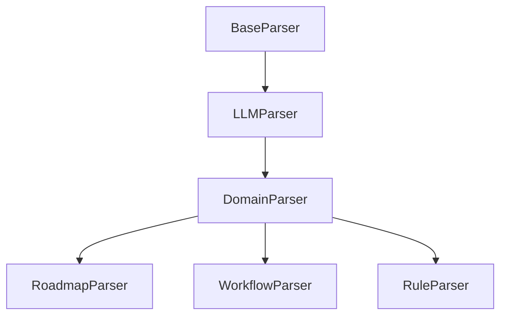

# refactor

1. 当前问题分析：

- `roadmap_processor.py` 和 `workflow_processor.py` 存在大量重复代码：
  - 都实现了类似的 LLM 调用逻辑
  - 都有相似的文件处理、缓存、错误处理机制
  - 都包含了类似的 JSON 解析和验证逻辑

- 没有复用 `llm_parser.py` 的原因可能是：
  - 历史原因，可能是先开发了单独的处理器
  - 特定领域的处理逻辑（如 roadmap 和 workflow 的特殊字段处理）
  - 缺乏统一的抽象层

2. 改进方案：



具体改进建议：

1. 重构处理器架构：

```python
# 领域解析器基类
class DomainParser(LLMParser):
    def __init__(self, domain_type: str, config: Optional[Dict] = None):
        super().__init__(config)
        self.domain_type = domain_type
        self.validator = self._create_validator()

    def _create_validator(self):
        # 根据 domain_type 创建对应的验证器
        pass

    async def parse_content(self, content: str) -> Dict[str, Any]:
        # 通用的解析流程
        result = await self.parse_text(content, self.domain_type)
        return self._post_process(result)

    def _post_process(self, result: Dict) -> Dict:
        # 领域特定的后处理
        raise NotImplementedError
```

2. 实现特定领域解析器：

```python
class RoadmapParser(DomainParser):
    def __init__(self, config: Optional[Dict] = None):
        super().__init__("roadmap", config)

    def _post_process(self, result: Dict) -> Dict:
        # Roadmap 特定的处理逻辑
        result = self.fix_field_mapping(result)
        result = self.fix_priority_format(result)
        return result

class WorkflowParser(DomainParser):
    def __init__(self, config: Optional[Dict] = None):
        super().__init__("workflow", config)

    def _post_process(self, result: Dict) -> Dict:
        # Workflow 特定的处理逻辑
        return self.fix_empty_fields(result)
```

3. 优化 `rule_processor.py`：

```python
class RuleParser(DomainParser):
    def __init__(self, config: Optional[Dict] = None):
        super().__init__("rule", config)

    def _post_process(self, result: Dict) -> Dict:
        # 规则特定的处理逻辑
        if not self._validate_rule_structure(result):
            result["validation"] = {"valid": False, "errors": ["Invalid structure"]}
        return result

    def process_directory(self, directory_path: str, pattern: str = "**/*.mdc") -> List[Dict]:
        # 目录处理逻辑
        pass
```

4. 统一功能实现：

- 将通用功能移至基类：
  - 缓存机制
  - 文件处理
  - 错误处理
  - LLM 调用
  - 临时文件管理

- 在领域特定类中只保留：
  - 特定的数据结构验证
  - 领域特定的字段处理
  - 自定义的后处理逻辑

5. 改进建议：

- 使用依赖注入：

```python
class DomainParser:
    def __init__(self, llm_service: LLMService, validator: Validator):
        self.llm_service = llm_service
        self.validator = validator
```

- 添加中间件支持：

```python
class ParserMiddleware:
    async def pre_process(self, content: str) -> str:
        pass

    async def post_process(self, result: Dict) -> Dict:
        pass
```

- 增强错误处理：

```python
class ParsingError(Exception):
    def __init__(self, message: str, details: Dict = None):
        super().__init__(message)
        self.details = details or {}
```

6. 迁移策略：

1) 创建新的基础设施
2) 逐步迁移现有处理器
3) 添加测试确保功能一致性
4) 使用适配器模式保持向后兼容
5) 逐步替换旧的实现

这样的重构将带来以下好处：

- 代码复用度提高
- 维护成本降低
- 功能扩展更容易
- 测试更加集中
- 错误处理更统一
- 性能优化更方便

需要注意的事项：

1. 确保向后兼容性
2. 添加充分的测试覆盖
3. 分阶段进行重构
4. 保持文档同步更新
5. 考虑性能影响
