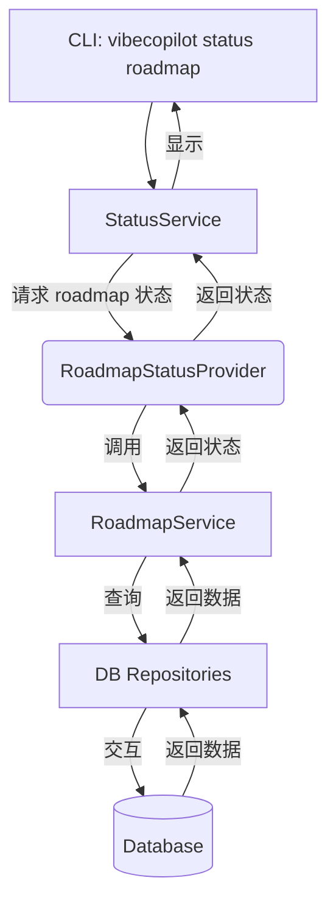

# Roadmap 状态集成与修复指南

本指南旨在帮助诊断和修复 VibeCopilot 中与路线图 (Roadmap) 状态相关的集成问题，特别是 Status 模块无法正确获取或更新 Roadmap 状态的情况，以及当前路线图切换功能无法持久化导致的问题。切换路线图后需要关闭终端或重启应用时，所选择的活动路线图状态会丢失。

## 相关模块与架构

理解状态集成问题需要了解以下关键模块：

1. **Status 模块 (`src/status/`)**: 系统的中央状态管理中心。参考 [`src/status/README.md`](../src/status/README.md)。
    - `StatusService`: 核心服务，管理提供者和订阅者。
    - `RoadmapStatusProvider`: Status 模块中的特定提供者，负责与 Roadmap 模块交互以获取状态信息。
2. **Roadmap 模块 (`src/roadmap/`)**: 负责路线图数据的管理和操作。参考 [`src/roadmap/README.md`](../src/roadmap/README.md)。
    - `RoadmapService`: Roadmap 模块的主要服务接口。
3. **模型模块 (`src/models/`)**: 定义业务逻辑层面的数据模型和转换功能。
    - `roadmap_model.py`: 提供路线图相关的数据模型和转换功能，处理业务层面的验证规则和约束。
    - 负责处理各种实体（如Roadmap、Epic、Story、Task等）的创建、验证和转换。
4. **数据库模块 (`src/db/`)**: 提供数据持久化。
    - `connection_manager.py`: 管理数据库连接。
    - `repositories/`: 包含如 `RoadmapRepository`, `TaskRepository` 等，处理具体的数据库交互。
    - `models/db/`: 定义 SQLAlchemy 数据模型 (如 `Roadmap`, `Epic`, `Story`, `Task`, `Milestone`)。

**核心交互流程**: Status 命令 (`vibecopilot status roadmap`) → `StatusService` → `RoadmapStatusProvider` → `RoadmapService` → 数据库/缓存 → 返回状态。



## 问题诊断步骤

### 1. 确认 Status 服务和 Provider 注册

检查 `StatusService` 是否成功初始化，并且 `RoadmapStatusProvider` 是否已正确注册。

```bash
# 运行此命令应能看到 'roadmap' 提供者
vibecopilot status list-providers
```

如果 `roadmap` 未列出，或 `StatusService` 初始化失败，请检查：

- `src/status/service.py` 中的 `_register_default_providers` 方法。
- `RoadmapStatusProvider` (`src/status/providers/roadmap_provider.py`) 的初始化逻辑是否有错误（如依赖的 `RoadmapService` 初始化失败）。
- Python 环境和依赖是否完整。

### 2. 检查 Roadmap 服务本身

直接调用 `RoadmapService` 的方法，看是否能正常获取数据。

```python
# (在 Python 交互环境或脚本中)
from src.roadmap import RoadmapService
from src.db import init_db, get_session_factory

try:
    # 确保数据库初始化
    init_db()
    session = get_session_factory()()
    # 创建服务实例 (实际应用中可能通过依赖注入)
    roadmap_service = RoadmapService(session=session)

    # 尝试获取所有路线图
    roadmaps = roadmap_service.list_roadmaps()
    print(f"发现 {len(roadmaps)} 个路线图: {roadmaps}")

    # 尝试获取活动路线图状态概览
    active_id = roadmap_service.get_active_roadmap_id()
    if active_id:
        summary = roadmap_service.get_roadmap_status_summary(active_id)
        print(f"活动路线图 ({active_id}) 状态: {summary}")
    else:
        print("没有设置活动路线图")

except Exception as e:
    print(f"测试 RoadmapService 时出错: {e}")
finally:
    if 'session' in locals():
        session.close()
```

如果此步骤失败，问题可能出在：

- `RoadmapService` 的实现 (`src/roadmap/service/`)。
- 数据库连接或数据访问层 (`src/db/repositories/`)。
- 数据模型定义 (`src/models/db/`) 与数据库表结构不匹配。

### 3. 检查数据库连接和表结构

- **连接配置**: 确认 `.env` 文件中的 `DATABASE_URL` (或其他相关配置) 是否正确。
- **数据库文件**: 检查配置的 SQLite 文件路径是否存在且具有读写权限。
- **表结构**: 使用数据库工具（如 DB Browser for SQLite）检查数据库文件，确认 `roadmaps`, `epics`, `stories`, `tasks`, `milestones` 等表是否存在且结构与 `src/models/db/` 中的模型定义一致。

```bash
# 尝试重新初始化数据库表 (警告: 会清空数据，除非表已存在且结构匹配)
# vibecopilot db init --force

```

**核心模型字段示例 (非完整)**:

- `Roadmap`: id, title, description, version, status, theme, created_at, updated_at
- `Epic`: id, title, description, status, priority, roadmap_id, created_at, updated_at
- `Story`: id, title, description, acceptance_criteria, status, priority, points, epic_id, created_at, updated_at
- `Task`: id, title, description, status, priority, estimated_hours, completed, story_id, assignee, labels, created_at, updated_at, completed_at
- `Milestone`: id, title, description, status, due_date, roadmap_id, created_at, updated_at

数据库模型设计采用了明确的层级关系，反映业务领域中的实际关系：

1. **Roadmap** 是顶层实体，代表一个完整的路线图计划
2. **Epic** 属于特定的 Roadmap (通过 roadmap_id 外键关联)
3. **Story** 属于特定的 Epic (通过 epic_id 外键关联)
4. **Task** 属于特定的 Story (通过 story_id 外键关联)
5. **Milestone** 属于特定的 Roadmap (通过 roadmap_id 外键关联)

这种设计允许我们通过层级关系进行级联查询，例如获取某个Roadmap下所有的Epics，或查询某个Epic下所有的Stories。

*注意：实际字段类型和约束请参考 `src/models/db/*.py` 中的 SQLAlchemy 模型定义。*

### 4. 检查数据是否存在

即使表结构正确，如果数据库中没有路线图数据（特别是没有设置活动路线图），`status roadmap` 命令也可能无法显示预期信息。

```bash
# 列出所有路线图，看是否有数据
vibecopilot roadmap list

# 如果列表为空，需要先创建或导入路线图
# 例如，从 YAML 导入:
vibecopilot roadmap import --source path/to/roadmap.yaml

# 导入后，设置一个活动路线图:
vibecopilot roadmap switch <imported_roadmap_id>
```

### 5. 查看日志

运行命令时增加日志级别或查看日志文件，可能会发现更详细的错误信息。

```bash
# (示例，具体命令可能不同)
LOG_LEVEL=DEBUG vibecopilot status roadmap
# 或者检查项目配置的日志文件
```

## 活动路线图状态持久化机制

活动路线图（当前被选中用于显示和操作的路线图）的状态通过以下机制进行持久化：

1. **持久化存储**: 活动路线图的ID保存在系统配置表中（`system_configs`表）
   - 键名: `active_roadmap_id`
   - 值: 当前活动路线图的ID (整数)

2. **切换机制**: 通过`vibecopilot roadmap switch <roadmap_id>`命令执行切换
   - 该命令调用`RoadmapService.set_active_roadmap(roadmap_id)`
   - 此方法负责更新系统配置表中的活动路线图ID

3. **状态获取**: `StatusService`通过以下流程获取活动路线图状态:
   - `RoadmapStatusProvider.get_status()`被调用
   - 该方法调用`RoadmapService.get_active_roadmap_id()`获取当前活动路线图ID
   - 然后调用`RoadmapService.get_roadmap_status_summary(active_id)`获取详细状态

4. **潜在问题**: 活动路线图状态丢失通常由以下原因导致:
   - 数据库事务未正确提交（`session.commit()`缺失）
   - 系统配置表缺少`active_roadmap_id`记录
   - 配置表存在但值无效（指向不存在的路线图ID）
   - 数据库连接问题导致无法读取持久化状态

5. **解决方案**:
   - 确保`RoadmapService.set_active_roadmap()`方法正确提交事务
   - 在应用启动时检查并初始化系统配置（如果缺失）
   - 在切换路线图后验证更改已成功持久化
   - 添加诊断日志以跟踪状态持久化过程

```python
# 实现示例 (RoadmapService中)
def set_active_roadmap(self, roadmap_id: int) -> bool:
    """设置活动路线图ID

    Args:
        roadmap_id: 要设置为活动的路线图ID

    Returns:
        bool: 操作是否成功
    """
    try:
        # 更新或创建系统配置记录
        config = self.config_repository.get_by_key("active_roadmap_id")
        if config:
            config.value = str(roadmap_id)
            self.config_repository.update(config)
        else:
            config = SystemConfig(key="active_roadmap_id", value=str(roadmap_id))
            self.config_repository.create(config)

        # 确保提交事务
        self.session.commit()
        return True
    except Exception as e:
        self.session.rollback()
        logger.error(f"设置活动路线图失败: {e}")
        return False
```

## 常见问题场景与解决

### 场景 1: `vibecopilot status list-providers` 没有列出 `roadmap`

- **原因**: `RoadmapStatusProvider` 未能成功注册。
- **解决**: 检查 `src/status/service.py` 中注册逻辑，检查 `RoadmapStatusProvider` 初始化过程 (`__init__`) 是否抛出异常（如依赖的 `RoadmapService` 无法实例化）。

### 场景 2: `vibecopilot status roadmap` 显示错误或无数据，但 `vibecopilot roadmap list/status` 正常

- **原因**: 问题出在 `RoadmapStatusProvider` 或 `StatusService` 与 `RoadmapService` 的交互上。
- **解决**:
  - 调试 `RoadmapStatusProvider` 的 `get_status` 方法 (`src/status/providers/roadmap_provider.py`)。
  - 确认 `StatusService` 调用 `get_status` 时传递的参数正确。
  - 检查 `RoadmapService` 返回的数据格式是否符合 `RoadmapStatusProvider` 的预期。

### 场景 3: 数据库相关错误 (如 `OperationalError`, `NoSuchTableError`)

- **原因**: 数据库文件问题、表不存在或结构不匹配。
- **解决**:
  - 执行上述 **步骤 3 (检查数据库连接和表结构)**。
  - 如果确定表结构有问题或需要重建，可谨慎使用 `vibecopilot db init --force` (会丢失现有数据)。
  - 确保模型定义 (`src/models/db/`) 和数据库模式一致。

### 场景 4: 状态显示为旧数据或未更新

- **原因**: 可能存在缓存（虽然当前架构文档未明确提及），或者状态更新逻辑未正确触发 `StatusService` 的通知机制（如果依赖订阅者更新）。但更可能是获取状态的查询逻辑本身有问题。
- **解决**:
- 重点检查 `RoadmapService` 中用于状态查询的方法 (如 `get_roadmap_status_summary`) 和其依赖的 Repository 查询。
- 确认 `RoadmapStatusProvider` 调用了正确的 `RoadmapService` 方法来获取最新状态。

### 场景 5: 路线图切换后状态丢失

- **原因**: 系统配置表中的`active_roadmap_id`值未正确持久化，或者在应用重启后未能正确加载。
- **解决**:
  - 检查`RoadmapService.set_active_roadmap()`方法确保事务提交：`session.commit()`
  - 验证系统配置表是否存在`active_roadmap_id`记录:
  ```sql
  SELECT * FROM system_configs WHERE key = 'active_roadmap_id';
  ```
  - 添加应用启动时检查并恢复活动路线图的逻辑
  - 检查会话管理是否跨请求或操作正确维护

## 业务模型与数据库模型的协作

`src.models`模块和`src.db`模块的协作是理解状态集成问题的关键：

1. **业务模型层 (`src.models.roadmap_model.py`)**
   - 提供业务逻辑和验证规则
   - 负责创建符合业务规则的实体对象
   - 定义状态转换和默认值规则
   - 示例：`RoadmapModel.validate_status()`验证状态值是否有效

2. **数据库模型层 (`src.db.models`)**
   - 定义数据库表结构和约束
   - 处理数据序列化和反序列化
   - 管理表关系和外键约束

3. **数据流**
   - CLI命令 → 解析参数 → 业务模型验证 → 数据库操作 → 持久化
   - 数据库 → Repository查询 → 数据库模型实例 → 业务模型转换 → 呈现结果

当状态问题发生时，需同时检查两个层面：

- 业务模型层可能存在验证逻辑错误或数据转换问题
- 数据库层可能存在查询、事务或关系问题

## 总结

修复 Roadmap 状态问题的关键在于逐层排查：从顶层的 Status 命令，到 Status 服务和 Provider，再到业务模型层，再到 Roadmap 服务，最后到底层的数据库交互和数据本身。特别需要关注活动路线图状态的持久化机制，确保系统配置正确保存和加载。通过上述诊断步骤，通常可以定位到问题的根源。
