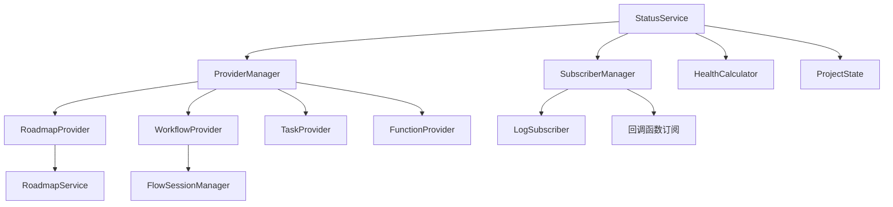

# Status 模块

## 简介

Status 模块是 VibeCopilot 的核心状态管理中心，负责统一管理和同步系统中各个领域的状态信息。它采用发布-订阅模式，将状态提供者和状态订阅者解耦，为整个系统提供一致的状态视图。

## 数据模型依赖

Status 模块依赖以下核心数据模型：

1. **WorkflowDefinition**: 工作流定义模型（`src/models/db/workflow_definition.py`）
2. **Stage**: 工作流阶段模型（`src/models/db/stage.py`）
3. **Transition**: 工作流转换模型（`src/models/db/transition.py`）
4. **Task**: 任务模型（`src/models/db/task.py`）
5. **FlowSession**: 工作流会话模型（`src/models/db/flow_session.py`）

各提供者与模型间的关系：

- **WorkflowStatusProvider**: 使用WorkflowDefinition和FlowSession模型
- **TaskStatusProvider**: 使用Task模型
- **RoadmapProvider**: 使用路线图相关模型

## 最近更新

- ✅ 已将所有旧WorkflowRepository引用替换为WorkflowDefinitionRepository
- ✅ TaskProvider升级为完整的类实现，同时保持向后兼容
- ✅ ExecutionSync从临时占位实现升级为正式实现
- ✅ 确保所有Provider适配新的数据模型关系

## 架构设计



### 核心组件

1. **StatusService**: 中央状态服务，管理状态提供者和订阅者
2. **ProviderManager**: 管理状态提供者的注册和获取
3. **SubscriberManager**: 管理状态订阅者的注册和通知
4. **IStatusProvider**: 状态提供者接口，由各领域模块实现
5. **IStatusSubscriber**: 状态订阅者接口，用于响应状态变更
6. **LogSubscriber**: 基本日志订阅者实现，记录状态变更

## 模块结构

```
src/status/
├── __init__.py        # 模块入口，导出主要组件
├── enums.py           # 状态枚举定义
├── interfaces.py      # 接口定义
├── README.md          # 本文档
├── service.py         # 状态服务实现
├── core/              # 核心组件
│   ├── __init__.py
│   ├── health_calculator.py    # 健康状态计算
│   ├── project_state.py        # 项目状态管理
│   ├── provider_manager.py     # 提供者管理
│   └── subscriber_manager.py   # 订阅者管理
├── providers/         # 状态提供者实现
│   ├── __init__.py
│   ├── roadmap_provider.py     # 路线图状态提供者
│   ├── task_provider.py        # 任务状态提供者
│   └── workflow_provider.py    # 工作流状态提供者
└── subscribers/       # 状态订阅者实现
    ├── __init__.py
    └── log_subscriber.py       # 日志订阅者
```

## 主要接口

### IStatusProvider

```python
class IStatusProvider(ABC):
    """状态提供者接口"""

    @property
    def domain(self) -> str:
        """获取领域名称"""
        ...

    def get_status(self, entity_id: Optional[str] = None) -> Dict[str, Any]:
        """获取状态信息"""
        ...

    def update_status(self, entity_id: str, status: str, **kwargs) -> Dict[str, Any]:
        """更新状态"""
        ...

    def list_entities(self, status: Optional[str] = None) -> List[Dict[str, Any]]:
        """列出实体"""
        ...
```

### IStatusSubscriber

```python
class IStatusSubscriber(ABC):
    """状态订阅者接口"""

    def on_status_changed(
        self,
        domain: str,
        entity_id: str,
        old_status: str,
        new_status: str,
        data: Dict[str, Any]
    ) -> None:
        """状态变更处理"""
        ...
```

## 使用方法

### 获取系统状态

```python
from src.status.service import StatusService

status_service = StatusService.get_instance()

# 获取系统整体状态
system_status = status_service.get_system_status()

# 获取特定领域状态
roadmap_status = status_service.get_domain_status("roadmap")
workflow_status = status_service.get_domain_status("workflow", entity_id="flow-123")
```

### 更新状态

```python
from src.status.service import StatusService

status_service = StatusService.get_instance()

# 更新工作流状态
result = status_service.update_status(
    domain="workflow",
    entity_id="flow-123",
    status="IN_PROGRESS",
    metadata={"reason": "用户操作"}
)

# 检查更新结果
if result.get("updated", False):
    print("状态更新成功")
else:
    print(f"状态更新失败: {result.get('error')}")
```

### 实现状态提供者

```python
from src.status.interfaces import IStatusProvider

class CustomStatusProvider(IStatusProvider):
    @property
    def domain(self) -> str:
        return "custom_domain"

    def get_status(self, entity_id: Optional[str] = None) -> Dict[str, Any]:
        # 实现获取状态的逻辑
        if entity_id:
            return {"id": entity_id, "status": "active", "domain": self.domain}
        return {"status": "ok", "entities_count": 5, "domain": self.domain}

    def update_status(self, entity_id: str, status: str, **kwargs) -> Dict[str, Any]:
        # 实现更新状态的逻辑
        return {"updated": True, "entity_id": entity_id, "status": status, "domain": self.domain}

    def list_entities(self, status: Optional[str] = None) -> List[Dict[str, Any]]:
        # 实现列出实体的逻辑
        entities = [
            {"id": "item-1", "status": "active", "domain": self.domain},
            {"id": "item-2", "status": "inactive", "domain": self.domain}
        ]
        if status:
            return [e for e in entities if e["status"] == status]
        return entities

# 注册到状态服务
status_service = StatusService.get_instance()
status_service.register_provider("custom_domain", CustomStatusProvider())
```

### 使用函数式提供者

```python
from src.status.service import StatusService

# 使用函数创建简单提供者
def get_simple_status():
    return {
        "status": "ok",
        "uptime": 3600,
        "version": "1.0.0"
    }

status_service = StatusService.get_instance()
status_service.register_provider("simple", get_simple_status)

# 获取状态
simple_status = status_service.get_domain_status("simple")
```

### 实现状态订阅者

```python
from src.status.interfaces import IStatusSubscriber

class CustomSubscriber(IStatusSubscriber):
    def on_status_changed(
        self,
        domain: str,
        entity_id: str,
        old_status: str,
        new_status: str,
        data: Dict[str, Any]
    ) -> None:
        # 实现状态变更处理逻辑
        print(f"状态变更: {domain}/{entity_id}: {old_status} -> {new_status}")
        # 可基于变更执行操作
        if domain == "workflow" and new_status == "COMPLETED":
            self.handle_workflow_completion(entity_id, data)

    def handle_workflow_completion(self, workflow_id, data):
        # 处理工作流完成事件
        pass

# 注册到状态服务
status_service = StatusService.get_instance()
status_service.register_subscriber(CustomSubscriber())
```

### 使用回调函数订阅状态

```python
from src.status.service import StatusService

def on_health_changed(status_type, status):
    health_level = status.get("overall_health", 0)
    print(f"系统健康状态变更: {health_level}%")
    if health_level < 50:
        print("警告: 系统健康度低!")

status_service = StatusService.get_instance()
subscription_id = status_service.subscribe("health", on_health_changed)

# 稍后可取消订阅
# status_service.unsubscribe(subscription_id)
```

## 当前提供者

当前系统已实现以下状态提供者：

1. **RoadmapStatusProvider**: 提供路线图状态，包括里程碑和任务
2. **WorkflowStatusProvider**: 提供工作流状态，基于FlowSessionManager
3. **TaskProvider**: 提供任务统计信息（简化实现）
4. **内置提供者**:
   - **health**: 提供系统健康状态
   - **project_state**: 提供项目状态信息

## 状态订阅者

目前系统实现了以下状态订阅者：

1. **LogSubscriber**: 基本日志订阅者，将状态变更记录到日志系统

## 改进说明

以下问题已在最新版本中解决：

1. ✅ **订阅机制缺少实际订阅者**:
   - 添加了LogSubscriber作为基本订阅者实现
   - 改进了注册和通知机制

2. ✅ **FunctionStatusProvider接口实现不完整**:
   - 为update_status和list_entities方法提供了合理的默认实现
   - 确保函数式提供者返回的状态信息包含domain字段

3. ✅ **状态更新路径不完整**:
   - 添加了统一的update_status方法作为状态更新入口
   - 确保状态更新能正确通知订阅者
   - 完善了状态变更通知流程

## 最佳实践

1. **状态定义**: 所有状态应在`enums.py`中集中定义，避免硬编码
2. **错误处理**: 状态提供者应妥善处理异常，提供恰当的错误信息和建议
3. **状态一致性**: 确保状态变更的原子性，避免状态不一致
4. **性能考虑**: 对于频繁访问的状态，考虑添加缓存机制
5. **订阅者设计**: 订阅者应快速处理通知，避免阻塞状态服务
6. **字段规范**: 状态信息应始终包含`domain`字段，更新结果应包含`updated`字段

## 后续开发计划

1. **增强状态持久化**: 添加状态历史记录和变更追踪
2. **提供API接口**: 对接外部系统查询和订阅状态变更
3. **状态可视化**: 实现状态监控面板，直观展示系统状态
4. **扩展订阅者**: 实现更多特定功能的订阅者（如通知、自动化操作等）
5. **缓存机制**: 为频繁访问的状态添加缓存，提高性能

## 与Health模块集成

Status模块现已与Health模块集成，提供了系统健康状态检查功能。集成主要通过以下方式实现：

1. **状态检查器**: 在Health模块中添加了`StatusChecker`，该检查器可以检查Status模块中各状态提供者的健康状态。

2. **健康度计算集成**: 利用Status模块中的`HealthCalculator`计算系统整体健康度，并生成标准化的健康报告。

3. **命令行支持**: 通过Health模块的CLI接口，可以使用`--module status`参数专门检查Status模块状态。

### 使用示例

```bash
# 检查状态模块健康
python -m src.health.cli check --module status

# 检查状态模块并生成详细报告
python -m src.health.cli check --module status --verbose --format markdown --output status_report.md

# 包含状态模块的全面系统检查
python -m src.health.cli check --module all
```

### 配置说明

状态模块健康检查配置位于`src/health/config/status_check_config.yaml`，主要配置项包括：

- 必需的状态提供者列表及其最低健康度要求
- 健康度计算的警告和严重阈值
- 状态管理器的最低提供者数量要求
- 系统整体健康度的最低要求
- API验证配置
- 检查执行配置
