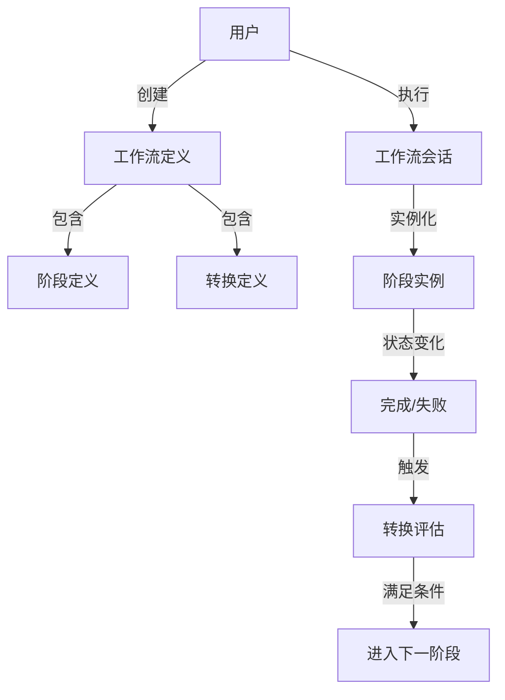

# VibeCopilot 工作流系统文档

欢迎使用VibeCopilot工作流系统文档。本文档集提供了工作流系统的设计、使用和开发指南。

## 文档索引

1. [**数据结构说明**](./data-structure.md) - 详细介绍工作流系统的数据模型和关系
2. [**迁移指南**](./migration-guide.md) - 说明从旧结构到新结构的迁移过程
3. [**使用指南**](./workflow-usage.md) - 提供工作流系统的使用方法和最佳实践

## 工作流系统概述

VibeCopilot工作流系统是一个灵活的工作流引擎，用于定义、管理和执行结构化流程。系统的主要特点包括：

- **灵活的工作流定义**：支持定义多阶段工作流，包含检查项和交付物
- **丰富的转换条件**：支持基于条件的阶段转换
- **会话管理**：支持创建和管理工作流会话
- **上下文共享**：在整个工作流生命周期中共享上下文数据
- **命令行接口**：提供完整的命令行接口操作工作流

## 核心概念

### 1. 工作流（Workflow）

工作流定义了一个完整的流程，包含多个阶段和阶段间的转换关系。每个工作流具有唯一标识、名称、描述等属性。

### 2. 阶段（Stage）

阶段是工作流中的基本执行单元，代表流程中的一个步骤。每个阶段包含名称、描述、检查项列表和交付物定义。阶段之间通过转换关系连接。

### 3. 转换（Transition）

转换定义了阶段之间的流转关系，包含源阶段、目标阶段和转换条件。转换条件决定了何时可以从源阶段进入目标阶段。

### 4. 会话（FlowSession）

会话是工作流的执行实例，记录了工作流执行过程中的状态和上下文数据。一个工作流可以有多个会话实例。

### 5. 阶段实例（StageInstance）

阶段实例是阶段在特定会话中的执行状态，记录了阶段的开始时间、完成时间、状态和交付物等信息。

## 快速开始

### 安装

确保已安装VibeCopilot环境：

```bash
cd /path/to/VibeCopilot
pip install -e .
```

### 创建工作流

```bash
# 创建工作流
vc flow create --name "软件开发流程" --description "从需求到上线的软件开发流程"

# 添加阶段
vc flow stage add --workflow "软件开发流程" --name "需求分析" --order 1
vc flow stage add --workflow "软件开发流程" --name "设计" --order 2
vc flow stage add --workflow "软件开发流程" --name "开发" --order 3
vc flow stage add --workflow "软件开发流程" --name "测试" --order 4
vc flow stage add --workflow "软件开发流程" --name "部署" --order 5

# 添加转换
vc flow transition add --workflow "软件开发流程" --from "需求分析" --to "设计"
vc flow transition add --workflow "软件开发流程" --from "设计" --to "开发"
vc flow transition add --workflow "软件开发流程" --from "开发" --to "测试"
vc flow transition add --workflow "软件开发流程" --from "测试" --to "部署"
```

### 执行工作流

```bash
# 启动工作流会话
vc flow run --workflow "软件开发流程" --name "项目A开发"

# 查看当前会话
vc flow session current

# 完成当前阶段并前进到下一阶段
vc flow next
```

## 架构图



## 技术栈

- **后端框架**：Python (FastAPI/Flask)
- **数据库**：SQLite/PostgreSQL
- **ORM**：SQLAlchemy
- **命令行**：Click
- **文档**：Markdown

## 贡献

欢迎参与VibeCopilot工作流系统的开发和改进：

1. 提交Issue报告问题
2. 提交Pull Request贡献代码
3. 改进文档和示例

## 许可

本项目遵循[MIT许可证](LICENSE)。
