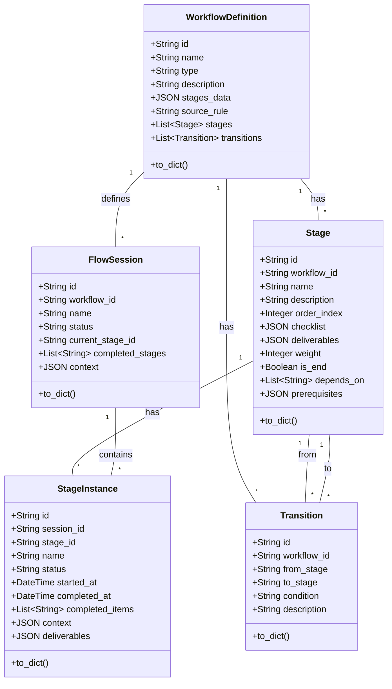

# 工作流系统数据结构说明

本文档详细介绍VibeCopilot工作流系统的数据模型结构，包括核心实体、关系和功能说明。

## 核心数据模型

工作流系统核心围绕以下主要实体：

1. **WorkflowDefinition**：工作流定义
2. **Stage**：工作流阶段
3. **Transition**：阶段间转换
4. **FlowSession**：工作流会话
5. **StageInstance**：阶段实例

## 实体关系图

## 详细模型说明

### 1. WorkflowDefinition（工作流定义）

工作流定义了整个流程的基本信息和结构。

**数据表**: `workflow_definitions`

| 字段 | 类型 | 描述 |
|-----|-----|-----|
| id | String | 主键，格式为"wfd_{uuid}" |
| name | String | 工作流名称 |
| type | String | 类型 |
| description | Text | 工作流描述 |
| stages_data | JSON | 阶段定义列表 |
| source_rule | String | 来源规则文件 |
| created_at | DateTime | 创建时间 |
| updated_at | DateTime | 更新时间 |

**关系**:

- `stages`: 一对多关系到Stage
- `transitions`: 一对多关系到Transition
- `sessions`: 一对多关系到FlowSession

### 2. Stage（工作流阶段）

工作流的主要组成部分，表示流程中的一个阶段或步骤。

**数据表**: `stages`

| 字段 | 类型 | 描述 |
|-----|-----|-----|
| id | String | 主键 |
| workflow_id | String | 所属工作流定义ID（外键引用workflow_definitions.id） |
| name | String | 阶段名称 |
| description | Text | 阶段描述 |
| order_index | Integer | 排序序号 |
| checklist | JSON | 检查项列表 |
| deliverables | JSON | 交付物定义 |
| weight | Integer | 阶段权重，用于排序 |
| estimated_time | String | 预计完成时间 |
| is_end | Boolean | 是否为结束阶段 |
| depends_on | JSON | 依赖的阶段ID列表 |
| prerequisites | JSON | 阶段前置条件 |
| created_at | DateTime | 创建时间 |
| updated_at | DateTime | 更新时间 |

**关系**:

- `workflow_definition`: 多对一关系到WorkflowDefinition
- `instances`: 一对多关系到StageInstance
- `from_transitions`: 一对多关系到Transition (作为源阶段)
- `to_transitions`: 一对多关系到Transition (作为目标阶段)

### 3. Transition（阶段转换）

定义阶段之间的转换关系和条件。

**数据表**: `transitions`

| 字段 | 类型 | 描述 |
|-----|-----|-----|
| id | String | 主键 |
| workflow_id | String | 所属工作流定义ID（外键引用workflow_definitions.id） |
| from_stage | String | 源阶段ID |
| to_stage | String | 目标阶段ID |
| condition | Text | 转换条件 |
| description | Text | 转换描述 |
| created_at | DateTime | 创建时间 |
| updated_at | DateTime | 更新时间 |

**关系**:

- `workflow_definition`: 多对一关系到WorkflowDefinition
- `from_stage_rel`: 多对一关系到Stage (源阶段)
- `to_stage_rel`: 多对一关系到Stage (目标阶段)

### 4. FlowSession（工作流会话）

工作流的执行实例，表示一次完整的工作流程执行。

**数据表**: `flow_sessions`

| 字段 | 类型 | 描述 |
|-----|-----|-----|
| id | String | 主键 |
| workflow_id | String | 所属工作流定义ID |
| name | String | 会话名称 |
| status | String | 状态（ACTIVE, PAUSED, COMPLETED, ABORTED） |
| created_at | DateTime | 创建时间 |
| updated_at | DateTime | 更新时间 |
| current_stage_id | String | 当前阶段ID |
| completed_stages | JSON | 已完成阶段ID列表 |
| context | JSON | 会话上下文 |

**关系**:

- `workflow_definition`: 多对一关系到WorkflowDefinition
- `stage_instances`: 一对多关系到StageInstance

## 仓库类

每个数据模型都有对应的仓库类，提供数据访问和操作方法：

1. **WorkflowDefinitionRepository**: 工作流定义仓库
2. **StageRepository**: 阶段仓库
3. **TransitionRepository**: 转换仓库
4. **FlowSessionRepository**: 会话仓库
5. **StageInstanceRepository**: 阶段实例仓库

## 数据流程

### 工作流创建流程

1. 创建WorkflowDefinition记录
2. 为WorkflowDefinition创建多个Stage记录
3. 创建Stage之间的Transition记录

### 会话执行流程

1. 基于WorkflowDefinition创建FlowSession
2. 根据工作流阶段创建StageInstance
3. 执行当前阶段，更新StageInstance状态
4. 根据Transition条件确定下一阶段
5. 移动到下一阶段，创建新的StageInstance
6. 重复执行直到达到结束阶段

## 注意事项

1. **模型调整**：系统已完成从Workflow模型到WorkflowDefinition模型的统一
2. **数据迁移**：如需处理历史数据，使用`migrate_workflow_structure.py`脚本进行数据迁移
3. **阶段条件**：通过`prerequisites`字段和`Transition.condition`控制阶段进入条件
4. **扩展性**：系统设计支持动态工作流，可以根据条件动态确定下一阶段
