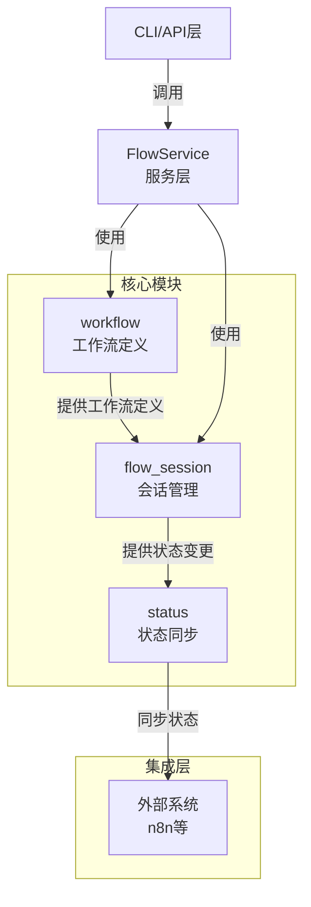
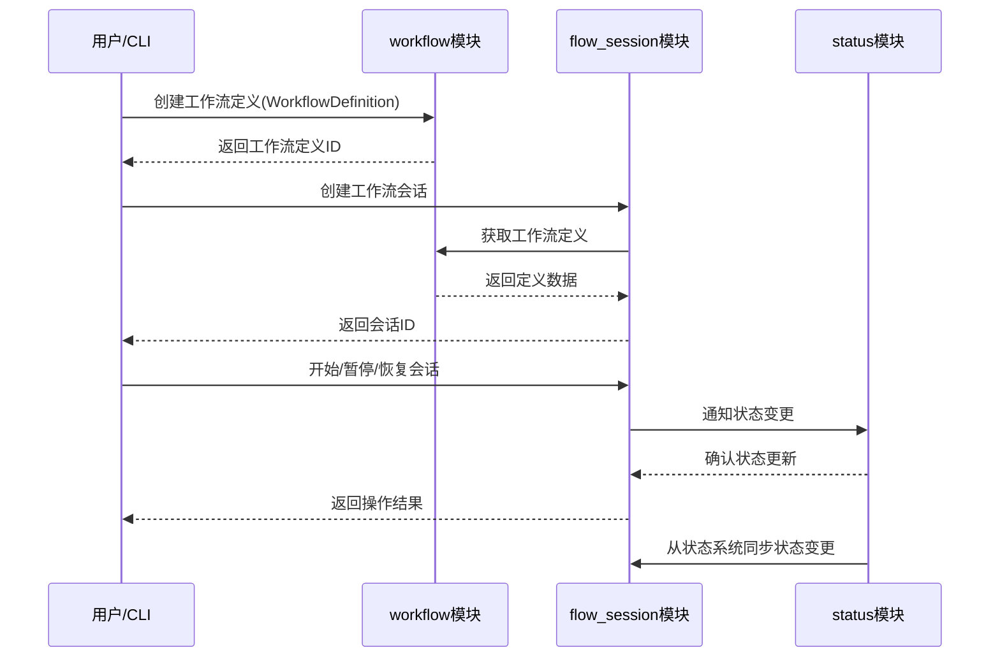
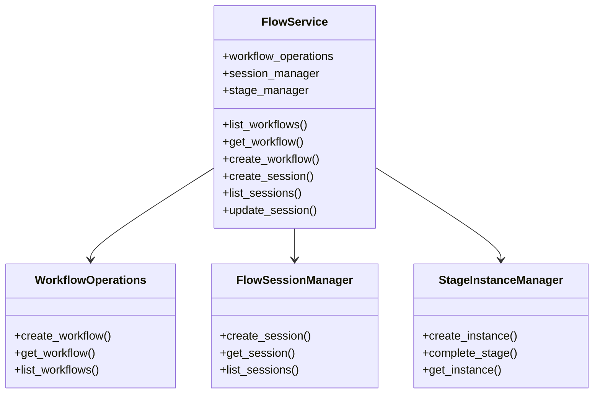

# VibeCopilot 模块架构设计

## 架构概览

VibeCopilot 工作流系统采用清晰的职责分离原则，将工作流管理拆分为三个核心模块，每个模块负责不同的关注点：

## 模块职责详解

### 1. Workflow 模块 (`src/workflow`)

**核心职责**: 管理工作流定义，包括创建、读取、更新和删除工作流定义。

**不负责**:

- 工作流执行
- 会话状态管理
- 外部系统集成

**主要组件**:

- **工作流解释器**: 解析工作流定义文件
- **工作流验证器**: 验证工作流定义的有效性
- **工作流模板引擎**: 基于模板创建新工作流
- **工作流搜索工具**: 查找和检索工作流

**关键文件**:

- `workflow_operations.py`: 基本CRUD操作
- `workflow_template.py`: 模板管理
- `interpreter/`: 工作流解释功能

**数据存储**:

- 工作流定义存储在 `data/workflows/` 目录下的JSON文件中
- 已迁移到数据库存储，使用WorkflowDefinition模型

### 2. Flow_Session 模块 (`src/flow_session`)

**核心职责**: 管理工作流执行会话，跟踪执行状态。

**不负责**:

- 工作流定义管理
- 外部状态同步

**主要组件**:

- **FlowSessionManager**: 管理会话的创建和生命周期
- **StageInstanceManager**: 管理单个阶段实例的状态
- **FlowStatusIntegration**: 实现与状态系统的接口

**关键文件**:

- `session/manager.py`: 会话管理
- `stage/manager.py`: 阶段管理
- `status/integration.py`: 与状态系统集成

**数据模型**:

- 会话(`FlowSession`): 工作流的执行实例
- 阶段实例(`StageInstance`): 单个阶段的执行状态
- 会话上下文(`SessionContext`): 会话执行的上下文数据

### 3. Status 模块 (`src/status`)

**核心职责**: 集中管理系统状态，提供状态观测和状态同步功能。

**不负责**:

- 工作流执行
- 会话状态变更

**主要组件**:

- **StatusService**: 中心状态服务
- **ProviderManager**: 管理状态提供者
- **SubscriberManager**: 管理状态订阅者

**关键文件**:

- `service.py`: 状态服务核心
- `providers/workflow_provider.py`: 工作流状态提供者

**设计模式**:

- 发布-订阅模式: 状态变更通知机制
- 观察者模式: 状态监听和响应

## 模块交互流程

### 1. 工作流创建和使用流程

### 2. 服务层设计 (FlowService)

`FlowService` 是连接 `workflow` 和 `flow_session` 模块的关键桥梁，它：

1. 提供统一接口访问工作流和会话功能
2. 确保两个模块之间的数据流动正确
3. 简化客户端代码，隐藏底层实现细节

## 数据流向

### 1. 工作流定义数据流

工作流定义的数据主要由 `workflow` 模块管理，使用WorkflowDefinition模型，包括：

- 创建和更新流向: CLI/API → FlowService → workflow模块 → 数据库(workflow_definitions表)
- 读取流向: CLI/API → FlowService → workflow模块 → 数据库 → 工作流定义数据

### 2. 会话状态数据流

会话状态的数据主要由 `flow_session` 模块管理，包括：

- 创建流向: CLI/API → FlowService → flow_session模块 → 存储
- 状态更新流向: 用户操作 → FlowService → flow_session模块 → status模块 → 外部系统

### 3. 状态同步数据流

系统状态的同步由 `status` 模块负责，包括：

- 内部状态更新: flow_session → WorkflowStatusProvider → StatusService → 订阅者
- 外部状态同步: 外部系统 → FlowStatusIntegration → flow_session模块

## 模块边界规范

为确保模块间职责清晰，我们制定以下规范：

### 1. Workflow 模块规范

- 只负责工作流定义的管理，不处理会话和状态
- 不应直接引用或依赖 `flow_session` 或 `status` 模块
- 提供清晰的公共API用于获取工作流定义

### 2. Flow_Session 模块规范

- 负责会话生命周期和状态管理
- 可以依赖 `workflow` 模块获取工作流定义
- 不应直接引用或依赖 `status` 模块的内部实现
- 通过 `FlowStatusIntegration` 与状态系统交互

### 3. Status 模块规范

- 负责状态观测和同步，不直接管理业务逻辑
- 通过 `WorkflowStatusProvider` 获取工作流状态
- 不应尝试执行或管理工作流

## 未来架构演进

随着系统不断发展，我们计划进行以下架构演进：

1. **数据存储升级**:
   - 从文件系统迁移到数据库存储
   - 实现更好的查询和分析能力

2. **API层增强**:
   - 提供完整的RESTful API
   - 实现GraphQL查询接口

3. **事件驱动架构**:
   - 实现完整的事件总线
   - 基于事件实现松耦合的模块交互

4. **微服务拆分**:
   - 长期可能将三个核心模块拆分为独立服务
   - 通过API网关统一访问

## 最近更新

### 2025-04-13 数据库模型关系调整

遵循职责分离原则，我们对数据库模型进行了重要调整：

1. **统一工作流模型**:
   - 清理了Workflow模型，统一使用WorkflowDefinition模型
   - 修复了Stage和Transition模型中外键引用错误问题
   - 确保所有引用指向workflow_definitions表而非废弃的workflows表

2. **关系重定义**:
   - 将Stage和Transition的`workflow`关系重命名为`workflow_definition`
   - 在WorkflowDefinition模型中添加了与Stage和Transition的双向关系
   - 解决了关系命名与JSON字段冲突的问题

3. **导入引用更新**:
   - 修复了对已不存在模型的导入引用
   - 移除了对历史遗留模型的导出

这些数据库调整确保了模型关系的一致性，为进一步开发奠定了坚实基础。

### 2023-10-25 工作流模块重构

遵循职责分离原则，我们对工作流系统进行了重要重构：

1. **移除冗余执行代码**:
   - 移除了 `src/workflow/execution/workflow_execution.py` 中的 `execute_workflow` 函数
   - 移除了 `src/workflow/execution/execution_operations.py` 中的 `execute_workflow` 函数
   - 更新了相关导入和导出，确保API保持一致

2. **明确模块职责**:
   - `workflow` 模块现在专注于工作流定义管理，不再处理执行逻辑
   - 工作流执行功能由 `flow_session` 模块全权负责
   - 状态同步由 `status` 模块处理

3. **优化代码组织**:
   - 更新了模块文档和注释，明确API用途
   - 减少了模块间的不必要依赖
   - 简化了代码调用路径

这些变更确保了架构更加清晰，各模块职责边界更加明确，为未来的数据库迁移和功能扩展做好了准备。

## 参考资料

- [工作流系统开发计划](./dev-plan.md)
