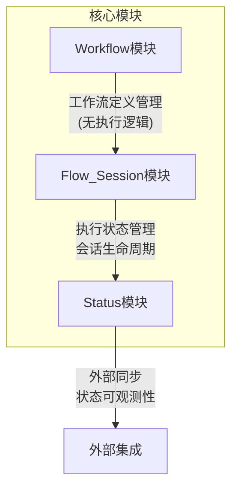

# VibeCopilot 工作流系统重构方案

## 当前问题分析

经过对代码库的审查，我们发现了以下核心问题：

1. **职责混淆**：当前 `workflow` 模块既承担工作流定义管理，又涉及工作流执行逻辑
2. **代码冗余**：多个地方包含相似的执行功能（`workflow_execution.py` 和 `execution_operations.py`）
3. **不必要的导入**：`workflow` 模块不应导入和依赖 `flow_session` 逻辑
4. **模块间边界模糊**：三个核心模块（workflow、flow_session、status）的职责分隔不清

## 架构定位明确化

我们需要明确三个核心模块的定位：

### 1. Workflow 模块

- **核心职责**：管理工作流定义（创建、读取、更新、删除）
- **不涉及**：工作流执行逻辑
- **主要组件**：
  - 工作流解释器（解释工作流定义）
  - 工作流定义验证器
  - 工作流存储接口

### 2. Flow_Session 模块

- **核心职责**：管理工作流执行状态和会话生命周期
- **主要组件**：
  - 会话管理器（创建、暂停、恢复、终止会话）
  - 阶段实例管理器（跟踪当前阶段和已完成阶段）
  - 上下文管理（保存会话上下文和状态）

### 3. Status 模块

- **核心职责**：同步和观测系统状态
- **主要组件**：
  - 状态提供者（从各个领域聚合状态）
  - 订阅者管理（响应状态变更）
  - 外部集成接口（可能与 n8n 等外部系统集成）

## 具体重构任务

### 1. 清理 Workflow 模块

1. **删除执行代码**：
   - 移除 `src/workflow/execution/workflow_execution.py` 中的 `execute_workflow` 函数
   - 移除 `src/workflow/execution/execution_operations.py` 中的 `execute_workflow` 函数
   - 保留其他有用功能，如 `save_execution`、`get_executions_for_workflow` 等

2. **更新导入和导出**：
   - 修改 `src/workflow/__init__.py`，移除 `execute_workflow` 的导入和导出
   - 更新相关导入路径，确保不再引用已删除的函数

3. **清理冗余导入**：
   - 在 `workflow` 模块中清理任何对 `flow_session` 的不必要导入

### 2. 增强 FlowService 作为连接点

现有的 `FlowService` 类已经设计良好，但需要确保：

1. **明确连接职责**：
   - 确保 `FlowService` 作为 `workflow` 和 `flow_session` 之间的有效桥梁
   - 通过它集成工作流定义管理和会话管理功能

2. **避免直接依赖**：
   - `workflow` 模块不应直接依赖 `flow_session`
   - 通过 `FlowService` 中转任何需要跨模块的操作

### 3. 确保 Status 模块正确集成

1. **验证 FlowStatusIntegration**：
   - 确保它正确地将 `flow_session` 的状态变更传递给状态系统
   - 不应包含工作流执行逻辑，只负责状态映射和同步

2. **明确 WorkflowStatusProvider**：
   - 确保它从 `flow_session` 模块获取状态，而不是尝试执行工作流
   - 职责仅限于观测和报告状态，不涉及状态变更逻辑

## 实现路径

### 阶段 1：移除冗余执行代码

1. 检查代码
2. 删除 `src/workflow/execution/workflow_execution.py` 中的 `execute_workflow` 函数
3. 删除 `src/workflow/execution/execution_operations.py` 中的 `execute_workflow` 函数
4. 更新 `src/workflow/__init__.py` 移除相关导入和导出
5. 运行测试确保系统仍能正常工作

### 阶段 2：完善模块边界

1. 检查所有从 `workflow` 到 `flow_session` 的导入，确保它们是必要的
2. 确保从 `workflow` 到 `flow_session` 的交互通过 `FlowService` 进行
3. 更新文档清晰描述每个模块的责任边界

### 阶段 3：增强 Status 模块集成

1. 审查 `FlowStatusIntegration` 确保它与当前架构一致
2. 验证 `WorkflowStatusProvider` 是否正确使用 `FlowSessionManager` 获取状态
3. 确保状态通知机制在模块间正确传递

## 预期收益

1. **代码清晰度**：职责明确分离，避免混淆
2. **减少冗余**：消除重复的执行代码
3. **模块化改进**：每个模块专注于其核心职责
4. **可维护性**：更易于理解和维护的代码库
5. **扩展性**：清晰的模块边界使得系统更容易扩展

## 测试计划

1. **单元测试**：确保每个组件的基本功能正常工作
2. **集成测试**：验证模块间交互符合预期
3. **端到端测试**：测试完整的工作流创建和执行流程

## 下一步建议

1. 考虑将执行历史记录功能从 `workflow` 模块移至更合适的位置
2. 优化 `FlowService` 作为中央服务接口，统一工作流和会话操作
3. 考虑实现完整的数据库迁移，将文件存储迁移至 SQLite/PostgreSQL
